# Career Path & Roles in DevSecOps

> **Module:** 01-Overview | **Difficulty:** ⭐⭐⭐ | **Reading time:** ~40 min

---

## Sources & Citations

| Reference | URL |
|-----------|-----|
| (ISC)² Cybersecurity Workforce Study 2023 | https://www.isc2.org/research/workforce-study |
| LinkedIn Jobs on the Rise 2024 | https://www.linkedin.com/pulse/linkedin-jobs-rise-2024-linkedin-news/ |
| SANS 2023 DevSecOps Survey | https://www.sans.org/white-papers/devsecops-survey-2023/ |
| Gartner: Top Security and Risk Management Trends 2024 | https://www.gartner.com/en/articles/gartner-top-security-and-risk-management-trends-2024 |
| CNCF Annual Survey 2023 | https://www.cncf.io/reports/cncf-annual-survey-2023/ |
| CKS Exam Curriculum | https://github.com/cncf/curriculum/blob/master/CKS_Curriculum_v1.30.pdf |
| AWS Certified Security Specialty | https://aws.amazon.com/certification/certified-security-specialty/ |
| CISSP Exam Outline | https://www.isc2.org/certifications/cissp/cissp-cbk |
| GREM (GIAC Reverse Engineering Malware) | https://www.giac.org/certifications/reverse-engineering-malware-grem/ |
| OSCP Certification | https://www.offsec.com/courses/pen-200/ |
| Stack Overflow Developer Survey 2023 | https://survey.stackoverflow.co/2023/ |
| Levels.fyi Engineering Levels | https://www.levels.fyi/ |

---

## 1. Role Landscape

DevSecOps is a field that sits at the intersection of three traditional disciplines. Understanding the boundaries and overlaps helps you position yourself and communicate your value clearly in interviews.

```mermaid
graph TD
    subgraph Intersection["DevSecOps Intersection"]
        Dev["👨‍💻 Software\nEngineering\n(Dev)\n• Code quality\n• Architecture\n• CI/CD\n• Testing"]
        Ops["⚙️ Platform /\nOperations\n(Ops)\n• Infrastructure\n• Kubernetes\n• Observability\n• Reliability"]
        Sec["🔒 Security\n(Sec)\n• AppSec\n• CloudSec\n• Compliance\n• Threat Intel"]

        DevOps["DevOps\nEngineer"]
        AppSec["Application\nSecurity\nEngineer"]
        CloudSec["Cloud Security\nEngineer"]
        DevSecOps["⭐ DevSecOps\nEngineer"]

        Dev --- DevOps
        Ops --- DevOps
        Dev --- AppSec
        Sec --- AppSec
        Ops --- CloudSec
        Sec --- CloudSec
        Dev --- DevSecOps
        Ops --- DevSecOps
        Sec --- DevSecOps
    end

    style DevSecOps fill:#4a90d9,color:#fff
```



### Role Definitions

| Role | Primary Focus | Security Depth | Dev Depth | Ops/Infra Depth |
|------|--------------|----------------|-----------|-----------------|
| **DevSecOps Engineer** | Embedding security into SDLC and platform | High | Medium-High | High |
| **Application Security Engineer** | Securing the application layer (SAST, DAST, threat modeling) | Very High | High | Low-Medium |
| **Cloud Security Engineer** | Securing cloud infrastructure (IAM, CSPM, network) | High | Low-Medium | High |
| **Platform Security Engineer** | Securing the platform/Kubernetes layer | High | Medium | Very High |
| **Security Engineer (Generalist)** | Broad security across the stack | High | Low | Medium |
| **Site Reliability Engineer (SRE)** | Reliability and availability; security as secondary | Medium | High | Very High |
| **Security Architect** | Security design and strategy | Very High | Medium | Medium |
| **CISO / Security Director** | Business risk, strategy, compliance | High (strategic) | Low | Low |

---

## 2. Typical Career Trajectory


### What Changes at Each Level

| Level | Technical Scope | Business Scope | Influence | Time Horizon |
|-------|----------------|----------------|-----------|--------------|
| **Junior/Mid** | Own component/service | Own team | Team members | Weeks/sprints |
| **Senior** | Multiple services / platform | Own org/product | Cross-team | Quarter |
| **Staff/Principal** | Organization-wide patterns | Business unit / product line | Cross-org | Year+ |
| **Distinguished/Fellow** | Industry-wide patterns | Company strategy | Industry | 3-5 years |
| **Manager** | Team execution | Team/org budget | Team + partners | Quarter |
| **Director** | Multiple team strategies | Product/business unit | Organization | Year |
| **VP/CISO** | Company security strategy | Company risk/compliance | Board/C-suite | 3-5 years |

---

## 3. Skills Matrix

### Technical Skills by Level

| Skill Domain | Junior (0–2 yr) | Mid-Level (3–5 yr) | Senior (6–10 yr) | Staff/Principal (10+ yr) |
|---|---|---|---|---|
| **Linux/OS fundamentals** | ⭐⭐⭐ proficient | ⭐⭐⭐⭐ advanced | ⭐⭐⭐⭐⭐ expert | ⭐⭐⭐⭐⭐ expert + teaching |
| **Scripting (Python/Bash)** | ⭐⭐ basic scripts | ⭐⭐⭐ complex automation | ⭐⭐⭐⭐ tools + frameworks | ⭐⭐⭐⭐⭐ platform tooling |
| **CI/CD (GitHub Actions, Tekton)** | ⭐⭐ use existing | ⭐⭐⭐ build pipelines | ⭐⭐⭐⭐ platform pipelines | ⭐⭐⭐⭐⭐ org-wide standards |
| **Containers / Docker** | ⭐⭐⭐ run and build | ⭐⭐⭐⭐ optimize and secure | ⭐⭐⭐⭐⭐ full lifecycle | ⭐⭐⭐⭐⭐ + standards |
| **Kubernetes** | ⭐⭐ basic objects | ⭐⭐⭐ RBAC, helm, ops | ⭐⭐⭐⭐ security, network, policy | ⭐⭐⭐⭐⭐ full platform design |
| **IaC (Terraform)** | ⭐⭐ apply configs | ⭐⭐⭐ write modules | ⭐⭐⭐⭐ org module library | ⭐⭐⭐⭐⭐ architecture patterns |
| **Cloud (AWS/GCP/Azure)** | ⭐⭐ use services | ⭐⭐⭐ IAM + networking | ⭐⭐⭐⭐ security + compliance | ⭐⭐⭐⭐⭐ multi-cloud strategy |
| **SAST/DAST/SCA** | ⭐⭐ run scans | ⭐⭐⭐ integrate + triage | ⭐⭐⭐⭐ tune + platform | ⭐⭐⭐⭐⭐ evaluate + evolve |
| **Cryptography** | ⭐⭐ use TLS/certs | ⭐⭐⭐ PKI, signing | ⭐⭐⭐⭐ KMS, key management | ⭐⭐⭐⭐⭐ crypto architecture |
| **Threat Modeling** | ⭐ awareness | ⭐⭐⭐ STRIDE for services | ⭐⭐⭐⭐ full PASTA/attack trees | ⭐⭐⭐⭐⭐ org methodology |
| **Compliance Frameworks** | ⭐ awareness | ⭐⭐⭐ SOC 2 basics | ⭐⭐⭐⭐ SOC 2 + PCI + HIPAA | ⭐⭐⭐⭐⭐ FedRAMP + custom |
| **Incident Response** | ⭐⭐ follow playbooks | ⭐⭐⭐ triage + contain | ⭐⭐⭐⭐ lead IR + build playbooks | ⭐⭐⭐⭐⭐ program design |
| **Policy as Code (OPA/Rego)** | ⭐ awareness | ⭐⭐⭐ write policies | ⭐⭐⭐⭐ platform policies | ⭐⭐⭐⭐⭐ policy framework |
| **Supply Chain Security** | ⭐ awareness | ⭐⭐⭐ SBOM + signing | ⭐⭐⭐⭐ SLSA + provenance | ⭐⭐⭐⭐⭐ org strategy |

### Behavioral / Leadership Skills by Level

| Skill | Senior | Staff | Principal/Architect |
|-------|--------|-------|---------------------|
| Technical decision-making | For own team | Cross-team | Organization-wide |
| Communication | Engineers | Engineers + managers | C-suite + board |
| Mentoring | 1-2 individuals | Small cohort | Program / culture |
| Influence | Team | Department | Company + external |
| Strategic planning | 1 quarter | 1 year | 2-3 year roadmap |
| Vendor evaluation | Tools for team | Platform tools | Strategic partnerships |
| Budgeting | Input to team budget | Manage team budget | Define program budget |
| Hiring | Interview loop | Define criteria | Build team strategy |

---

## 4. Certifications

### Certifications Matrix for DevSecOps Engineers

| Certification | Domain | Difficulty | Time to Prepare | Who Should Get It |
|---------------|--------|------------|-----------------|-------------------|
| **CKA** (Certified Kubernetes Administrator) | Kubernetes platform | ⭐⭐⭐ | 2–3 months | Any DevSecOps/Platform eng |
| **CKS** (Certified Kubernetes Security Specialist) | Kubernetes security | ⭐⭐⭐⭐⭐ | 2–3 months (after CKA) | Platform security, K8s-focused |
| **CKAD** (Certified Kubernetes App Developer) | K8s app development | ⭐⭐⭐ | 1–2 months | AppSec + Dev-side engineers |
| **AWS Certified Security Specialty** | AWS security | ⭐⭐⭐⭐ | 2–3 months | Cloud security engineers |
| **AWS Solutions Architect Professional** | AWS architecture | ⭐⭐⭐⭐ | 3–4 months | Senior+ cloud engineers |
| **GCP Professional Cloud Security Engineer** | GCP security | ⭐⭐⭐⭐ | 2–3 months | GCP-focused engineers |
| **Azure Security Engineer Associate (AZ-500)** | Azure security | ⭐⭐⭐ | 1–2 months | Azure-focused engineers |
| **CISSP** | Broad information security | ⭐⭐⭐⭐⭐ | 3–6 months | Security architects, managers |
| **CISM** | Security management | ⭐⭐⭐⭐ | 2–3 months | Security managers, directors |
| **CEH** (Certified Ethical Hacker) | Offensive security | ⭐⭐⭐ | 1–2 months | AppSec, red team roles |
| **OSCP** (Offensive Security Certified Professional) | Penetration testing | ⭐⭐⭐⭐⭐ | 3–6 months (hands-on lab) | Offensive security specialists |
| **GREM** (GIAC Reverse Engineering Malware) | Malware analysis | ⭐⭐⭐⭐⭐ | 3–6 months | IR, threat intel specialists |
| **GCIH** (GIAC Certified Incident Handler) | Incident response | ⭐⭐⭐⭐ | 2–3 months | IR-focused engineers |
| **CSSLP** (Certified Secure Software Lifecycle) | Secure SDLC | ⭐⭐⭐⭐ | 2–3 months | DevSecOps, AppSec engineers |
| **Terraform Associate** | IaC fundamentals | ⭐⭐ | 2–4 weeks | All DevSecOps engineers |
| **GitLab Certified Security Specialist** | GitLab DevSecOps | ⭐⭐ | 1–2 weeks | GitLab shops |

### Certification Priority by Role Track

```
DevSecOps Engineer (Platform-focused):
  Priority 1: CKA → CKS → AWS Security Specialty
  Priority 2: Terraform Associate → CSSLP
  Nice to have: CISSP (for leadership/architect roles)

Application Security Engineer:
  Priority 1: CSSLP → CEH or OSCP
  Priority 2: AWS Security Specialty
  Nice to have: GREM (if malware analysis is in scope)

Cloud Security Engineer:
  Priority 1: AWS Security Specialty → AWS SA Pro
  Priority 2: CKA (if Kubernetes is used)
  Nice to have: CISSP

Security Architect / Staff Engineer:
  Priority 1: CISSP → AWS Security Specialty
  Priority 2: CKS (if cloud native)
  Nice to have: CISM (if moving toward management)
```

### CKS Exam Domain Breakdown

The CKS exam is the most relevant certification for Kubernetes security practitioners. It requires a valid CKA certification first.

```
CKS Exam Domains and Weights (v1.30):
  ├── Cluster Setup (10%)
  │     └── Use CIS benchmarks, kubeadm hardening, network policies
  ├── Cluster Hardening (15%)
  │     └── RBAC, service account tokens, Kubernetes API security
  ├── System Hardening (15%)
  │     └── AppArmor, Seccomp, kernel module restrictions, syscall filtering
  ├── Minimize Microservice Vulnerabilities (20%)
  │     └── Pod security contexts, OPA/Gatekeeper, secret management, sandboxes (gVisor, Kata)
  ├── Supply Chain Security (20%)
  │     └── Image scanning, allowlist registries, signing/verification, SBOM
  └── Monitoring, Logging, and Runtime Security (20%)
        └── Falco, audit logs, immutable containers, detecting threats
```

---

## 5. Key Competencies Employers Look For (2024–2026)

Based on analysis of job postings, CNCF survey data, and SANS DevSecOps survey findings:

### Technical Competencies — High Demand

```
🔥 Hottest Skills (2024-2026):
  1. Kubernetes security (CKS-level knowledge)
     → 78% of enterprises running K8s; securing it is a critical gap
  
  2. Supply chain security (SLSA, SBOM, Sigstore)
     → Post-SolarWinds, XZ Utils: organizations scrambling to close this gap
  
  3. AI/ML security
     → New attack surface: model poisoning, prompt injection, LLM supply chain
     → Emerging area; early expertise is highly differentiated
  
  4. Policy as Code (OPA, Kyverno, Cedar)
     → Compliance automation at scale requires engineers who can write Rego
  
  5. Cloud security posture management (CSPM)
     → Multi-cloud is the norm; unified security visibility is a top ask
  
  6. Infrastructure as Code security (Terraform + Checkov/tfsec)
     → IaC is everywhere; securing it is a gap in most orgs
  
  7. Secrets management (Vault, external-secrets-operator, SOPS)
     → Secrets sprawl and rotation are universal pain points
  
  8. Zero Trust implementation
     → Network redesigns and identity-centric access are long-term projects
```

### Technical Competencies — Table Stakes (Expected at Senior Level)

```
✅ Expected Fundamentals:
  • CI/CD pipeline design and security integration (GitHub Actions, Tekton, Jenkins)
  • Container security (Dockerfile hardening, image scanning, runtime security)
  • Cloud IAM (least privilege, SCPs, permission boundaries)
  • SAST/DAST/SCA tool integration and tuning
  • Network security (VPC, security groups, NetworkPolicies)
  • Incident response and forensics
  • Compliance frameworks (SOC 2, ISO 27001, at least one regulated framework)
  • Scripting proficiency (Python, Bash, Go — at least two)
```

### Non-Technical Competencies at Senior Level

```
Communication and Influence:
  • Can explain security risk in business terms (cost, probability, impact)
  • Can write clear, actionable vulnerability reports that developers act on
  • Comfortable presenting to engineering leaders and non-technical stakeholders
  • Can push back on shortcuts while maintaining collaborative relationships

Program Building:
  • Can design and run a Security Champions program
  • Can build a vulnerability management process from scratch
  • Understands how to instrument and improve security metrics
  • Can write and own a security roadmap aligned to business goals

Cross-functional Partnership:
  • Treats legal, compliance, audit, and product teams as partners
  • Understands product and business context, not just technical risk
  • Can prioritize security work against competing feature development

Developer Enablement:
  • Focuses on unblocking developers securely, not blocking them
  • Builds security tooling that developers actually adopt
  • Measures developer experience with security tooling (not just findings count)
```

---

## 6. Salary and Compensation Landscape (2024)

*Note: Figures are US-based estimates from Levels.fyi, Glassdoor, and Blind data. Vary significantly by location, company size, and company type (FAANG vs. startup vs. enterprise).*

| Level | Base Salary Range | Total Compensation (TC) Range |
|-------|------------------|-------------------------------|
| Mid-Level DevSecOps Eng | $130K–$170K | $160K–$220K |
| Senior DevSecOps Eng | $170K–$230K | $220K–$350K |
| Staff/Principal Security Eng | $220K–$290K | $320K–$500K+ |
| Security Architect | $200K–$270K | $280K–$420K |
| Security Engineering Manager | $200K–$260K | $280K–$450K |
| Director, Security Engineering | $250K–$340K | $380K–$650K+ |
| CISO (mid-size company) | $250K–$350K | $300K–$600K+ |

### Highest-Value Skill Premiums (2024)

Based on job posting analysis and compensation data:
- **Kubernetes security (CKS):** +15–25% over base DevSecOps compensation
- **Supply chain security expertise:** +10–20% (scarce skill)
- **CISSP at senior IC level:** +5–10% (often required at architect/manager levels)
- **Multi-cloud security experience:** +10–15%
- **Federal/FedRAMP experience:** +15–25% (specialized market, high demand)

---

## 7. Interview Q&A

---

**Q1: How do you differentiate yourself as a Senior DevSecOps Engineer from a mid-level engineer, beyond years of experience?**

**A:** Experience is a proxy for impact, not a credential in itself. I define seniority by three dimensions:

**Scope of ownership:** A mid-level engineer owns their team's pipeline security. I own the security posture of a product or platform — which means I'm designing the controls architecture, not just implementing individual controls. I'm asking: "What's our SLSA maturity across all 200 repos?" not "Did I configure Snyk for my service?"

**Ambiguity tolerance:** Mid-level engineers are most effective when given clear requirements. At senior level, I'm comfortable in ambiguous situations — "our compliance audit in 4 months uncovered 30 gaps" — and I can create structure, prioritize, and drive closure without someone defining the path.

**Multiplier effect:** A great mid-level engineer delivers excellent individual work. A great senior engineer makes their team deliver excellent work. I measure my impact by my team's security posture improvement, not just my own contributions. This looks like: security champions program, internal tooling that accelerates other teams, threat modeling training I've delivered.

**Follow-up:** *"Tell me about a time you had a significant multiplier effect on your team's security."*
*(Use STAR method: Situation, Task, Action, Result)*

**What the interviewer is looking for:** Self-awareness about the IC career ladder, ability to articulate impact beyond task completion.

---

**Q2: How do you handle disagreement with the security team or with engineering leadership about risk prioritization?**

**A:** Disagreements about risk are normal and healthy — the goal is to make the best decision with imperfect information, not to "win."

My approach: I separate the disagreement type. Is it a factual disagreement (different understanding of the vulnerability's exploitability)? Or a values disagreement (different risk tolerance)? Different types require different resolution strategies.

For factual disagreements: I bring data — EPSS scores, CVE details, exploit availability, PoC code, CISA KEV listing. I invite the other party to review the data together. Usually this resolves it.

For values disagreements (risk tolerance): I escalate with a clear risk statement — "If we delay patching this for 30 days, given EPSS of 4.2% and our public-facing attack surface, I estimate a 12% probability of exploitation. I recommend patching in 7 days, but I understand the business decision is yours. I'll document this decision and its rationale." Then I document it, get sign-off, and monitor for exploitation.

What I don't do: accept implicit decisions. If engineering says "we'll do it next quarter" I need that captured explicitly so there's accountability and I can track it.

**Follow-up:** *"What if leadership overrides a decision that you genuinely believe is dangerous?"*
I document the risk, the recommendation, and the business decision. I escalate appropriately (to the CISO or their equivalent) if I believe the risk is material and the decision isn't being made with full information. If escalation is exhausted and the decision stands, I document the compensating controls being relied upon, and I monitor closely. If I believe the organization is operating negligently from a security standpoint, that's a signal about organizational values and a career decision.

**What the interviewer is looking for:** Professional maturity, ability to influence without authority, knowing when and how to escalate.

---

**Q3: Describe your philosophy on security training for developers. How do you actually change developer behavior rather than just checking a box?**

**A:** Compliance-based security training (annual 30-minute click-through) demonstrably does not change behavior. Research and practical experience both confirm this.

My philosophy: security training should be contextual, immediate, and tied to work developers are already doing.

**Concrete approaches that work:**

1. **Just-in-time training via tooling:** When a developer gets a SAST finding for SQL injection, don't just show them the vulnerability — link to a 2-minute explanation of *why* it's dangerous and a code example of the fix. The learning is attached to a real finding in their real code.

2. **Security Champions — peer learning:** The most effective security teachers are developers who care about security, not security specialists. I identify and invest in security champions who can contextualize security concepts in the language and patterns the team already uses.

3. **Red team exercises with the team:** Run a 30-minute "Find a vulnerability in our own app" exercise during a sprint. Nothing builds intuition like being the attacker for 30 minutes.

4. **Threat modeling in sprint planning:** 20 minutes per sprint, security champion leads: "What's the worst thing that can happen with this feature? How do we prevent it?" This builds habit and context.

5. **Measure behavior change:** Metrics that matter: % of security findings filed by developers themselves (not from scans), time from finding to developer acknowledgment, developer satisfaction with security tooling (survey). Annual compliance completion rate tells you nothing about behavior.

**What the interviewer is looking for:** Evidence of having actually run security programs, not just theoretical knowledge of developer relations.

---

**Q4: What does the career progression look like from Senior DevSecOps Engineer to Principal/Staff? What skills do you need to develop?**

**A:** The Senior → Staff transition is one of the hardest in the IC career ladder because it requires a fundamental shift in how you create value — from doing to multiplying.

**What doesn't change:** Technical depth. Staff engineers are more technically sophisticated than seniors, not less. You're expected to go deeper on architecture and design decisions.

**What changes:**
- **Scope:** You stop optimizing your team's work and start defining patterns that multiple teams adopt. "I designed the RBAC framework for all 15 teams" rather than "I configured RBAC for my team."
- **Ambiguity:** Staff engineers operate in the most undefined parts of the problem space. You're solving problems that nobody has fully articulated yet.
- **Influence model:** You rarely have direct authority over the teams implementing your designs. Influence through technical credibility, writing, collaboration, and sponsorship.
- **System thinking:** You're no longer optimizing components; you're designing systems. Trade-offs you make affect org-wide behavior, so you must think about incentives, adoption, and org dynamics.

**Skills to develop explicitly:**
1. Technical writing (RFCs, design documents that drive org-wide decisions)
2. Facilitation (running architecture reviews, cross-team working groups)
3. Roadmap thinking (what does our security posture need to look like in 2 years, and what's the path there?)
4. Executive communication (distilling complex technical risk into 3-minute board-level explanations)
5. Sponsorship (actively developing the next generation of senior engineers)

**Follow-up:** *"Is the Staff/Principal path right for everyone?"*
No, and that's fine. The Staff IC path requires comfort with ambiguity and large scope. Many exceptional Senior engineers are most impactful staying deep in a technical domain, or transitioning to engineering management. Know which path aligns with your strengths and what energizes you.

**What the interviewer is looking for:** Self-awareness about the career ladder, evidence of having reflected seriously on career growth, not just accumulating years.

---

**Q5: Which certifications do you have, and how have they contributed to your effectiveness on the job?**

**A:** *(Adapt to your own certifications. This answer models the right approach.)*

I hold CKA, CKS, and AWS Security Specialty. My philosophy on certifications:

**CKA and CKS:** These are both performance-based exams — you're running actual kubectl commands against real clusters under time pressure. That's genuinely useful because it forces you to practice until you're fluent, not just familiar. CKS in particular forced me to deeply understand areas I was previously hand-wavy about: AppArmor profiles, Seccomp configurations, and Falco rule writing. I emerged noticeably more effective in cluster hardening reviews.

**AWS Security Specialty:** Breadth certification — covers IAM, encryption, logging, incident response, infrastructure security across all AWS services. The value was systematic coverage of areas I'd only touched in context before (e.g., Macie for data classification, Detective for investigation). The exam preparation filled in gaps.

**What certifications don't do:** They don't make you a better communicator, a better cross-functional partner, or better at program strategy. I've met CISSP holders who couldn't explain a security risk to a product manager. The certifications that matter most for senior roles are the ones that cover domains where the organization has real gaps.

**What I recommend:** CKA/CKS for anyone in cloud-native environments. AWS Security Specialty for AWS-heavy shops. CISSP if you're moving toward architect or management. Then stop collecting certifications and invest the time in real projects.

**What the interviewer is looking for:** Honest assessment of certification value, not cert-collecting for resume padding.

---

**Q6: How do you build and maintain a Security Champions program? What makes it succeed or fail?**

**A:** A Security Champions program is a force multiplier — it embeds security expertise in every engineering team without requiring the security team to scale linearly.

**What makes it succeed:**

1. **Voluntary, not mandatory:** Champions who are forced into the role are ineffective. Identify engineers who are already asking security questions, flagging issues, or self-learning. Invite them; don't assign them.

2. **Real investment:** Champions need dedicated time (I recommend 10–15% of their sprint capacity), access to advanced security training, and a clear development path. If it's "extra work on top of your normal job," it collapses.

3. **Community:** Monthly community of practice calls, a dedicated Slack/Teams channel, shared threat intelligence, and peer learning. Champions should feel like they're part of a team, not isolated.

4. **Executive sponsorship:** Champions need cover when security work conflicts with sprint velocity. Their manager and VP need to understand and support the role.

5. **Clear scope:** Champions are not second-tier security team members. They are the first point of security contact for their team, triage automated findings, represent their team in security design reviews, and escalate to the security team for complex issues. Clear boundaries prevent scope creep.

**What makes it fail:**

- No dedicated time — champions are expected to do it "on the side"
- No community — champions feel isolated and burn out
- No escalation path — champions hit complex problems with no one to call
- No recognition — the work is invisible to managers and career development

**What the interviewer is looking for:** Practical program-building experience, not just awareness of the concept.

---

**Q7: Describe a situation where you had to make a significant security trade-off and how you communicated it to stakeholders.**

**A:** *(Use STAR method. Here's a model answer.)*

**Situation:** A major product launch was scheduled for Black Friday — the highest-traffic day of the year. Three weeks before launch, a critical CVE (CVSS 9.8, active exploit in the wild) was published in a library used by the checkout service. Patching required a significant library version upgrade that would take 2 weeks of development work, pushing past the launch date.

**Task:** Make a risk-based recommendation and get alignment from engineering, product, and legal.

**Action:** I quantified the risk in business terms: EPSS score of 5.4% suggested ~1 in 20 probability of exploitation in the next 30 days. The checkout service processed $8M/day. Exploiting the CVE would allow remote code execution with access to customer payment data. Potential cost: $4-20M in breach costs + GDPR fines + reputational damage.

I also quantified the patch cost: $50K in engineering time + potential $500K in missed Black Friday revenue if launch slipped.

My recommendation: deploy a WAF virtual patch targeting the specific attack vector (a specific HTTP parameter pattern). This would reduce exploitability to near-zero without requiring a code change, allowing the launch to proceed. Meanwhile, schedule the library upgrade for the two weeks following launch.

I presented this to the CPO, CTO, and legal counsel as: "Here is the risk, here is the cost of patching now vs. a compensating control, here is my recommendation, here are the residual risks." Legal confirmed the compensating control was sufficient for regulatory purposes.

**Result:** Launch proceeded. WAF rule deployed. Library upgraded 12 days post-launch. No exploitation during the window.

**What the interviewer is looking for:** Risk quantification ability, stakeholder communication skill, and pragmatism — security is about risk management, not zero risk.

---

**Q8: Where do you see the DevSecOps field evolving in the next 3–5 years? How are you preparing for those changes?**

**A:** Several major shifts are converging:

**1. AI/ML security as a primary domain.** LLMs and ML pipelines introduce new attack surfaces: prompt injection, training data poisoning, model theft, adversarial examples. The OWASP LLM Top 10 (published 2023) is the beginning. Engineers who understand both ML systems and security will be extremely valuable.

**2. Supply chain security goes mainstream.** Post-SolarWinds, post-Log4Shell, post-XZ Utils, every organization is now grappling with SBOM requirements, SLSA compliance, and dependency security at scale. The SBOM tooling ecosystem (DependencyTrack, GUAC, SBOM Observatory) is maturing rapidly.

**3. Policy as Code replacing manual review.** The combination of mature OPA/Rego tooling, Kyverno, and CI/CD integration means that security policies that used to require manual review can be expressed as code and enforced automatically. Engineers who can write high-quality, maintainable Rego and Kyverno policies will be in high demand.

**4. Compliance automation.** Manual audit prep will become increasingly automated. Platforms like Vanta, Drata, and Secureframe automate evidence collection; engineers who can extend these platforms and integrate them with custom CI/CD pipelines will accelerate compliance programs.

**5. Platform engineering absorbs security.** The emerging platform engineering discipline treats internal developer platforms as products. Security built into the platform — rather than bolted on — is the direction. Security engineers who can collaborate effectively with platform engineering teams will have outsized impact.

**How I'm preparing:**
- Actively learning LLM security: OWASP LLM Top 10, experimenting with prompt injection defenses, contributing to community discussion
- Getting hands-on with GUAC (Graph for Understanding Artifact Composition) for supply chain visibility at scale
- Deepening Rego skills — writing policies for production workloads, not just tutorials
- Following CNCF TAG-Security working groups for emerging cloud native security patterns

**What the interviewer is looking for:** Intellectual curiosity, forward-looking thinking, and evidence of active learning — not just reciting trends.

---

## 8. References

1. (ISC)² Cybersecurity Workforce Study 2023 — https://www.isc2.org/research/workforce-study
2. CNCF Annual Survey 2023 — https://www.cncf.io/reports/cncf-annual-survey-2023/
3. SANS 2023 DevSecOps Survey — https://www.sans.org/white-papers/
4. CKS Curriculum v1.30 — https://github.com/cncf/curriculum
5. AWS Certified Security Specialty — https://aws.amazon.com/certification/certified-security-specialty/
6. CISSP Exam Outline — https://www.isc2.org/certifications/cissp
7. GIAC GREM — https://www.giac.org/certifications/reverse-engineering-malware-grem/
8. OSCP — https://www.offsec.com/courses/pen-200/
9. Levels.fyi — https://www.levels.fyi/
10. LinkedIn Jobs on the Rise 2024 — https://www.linkedin.com/pulse/linkedin-jobs-rise-2024-linkedin-news/
11. OWASP LLM Top 10 — https://owasp.org/www-project-top-10-for-large-language-model-applications/
12. Gartner Top Security Trends 2024 — https://www.gartner.com/en/articles/gartner-top-security-and-risk-management-trends-2024
