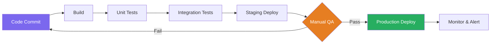
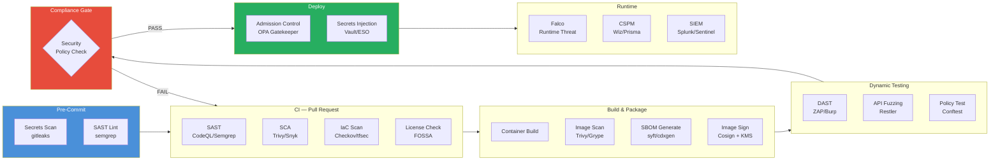
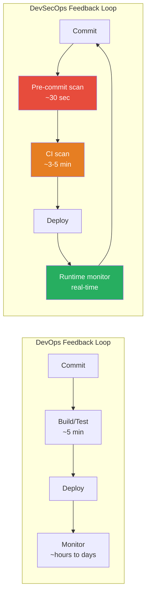
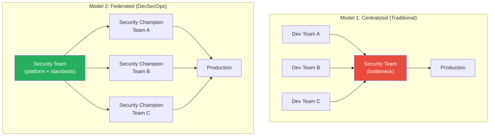

# DevOps vs DevSecOps

> **Module:** 01-Overview | **Difficulty:** ⭐⭐⭐ | **Reading time:** ~40 min

---

## Sources & Citations

| Reference | URL |
|-----------|-----|
| Google DORA State of DevOps 2023 | https://cloud.google.com/devops/state-of-devops |
| DORA Four Key Metrics (Forsgren et al.) | https://itrevolution.com/product/accelerate/ |
| Puppet State of DevOps Report 2023 | https://www.puppet.com/resources/state-of-devops-report |
| Gartner DevSecOps Definition | https://www.gartner.com/en/information-technology/glossary/devsecops |
| OWASP DevSecOps Guideline | https://owasp.org/www-project-devsecops-guideline/ |
| Veracode State of Software Security 2023 | https://www.veracode.com/state-of-software-security-report |
| CNCF Security TAG: Software Supply Chain BPS | https://github.com/cncf/tag-security/blob/main/supply-chain-security/supply-chain-security-paper/CNCF_SSCP_v1.pdf |
| NIST SP 800-53 Rev 5 | https://csrc.nist.gov/publications/detail/sp/800-53/rev-5/final |
| Snyk State of Open Source Security 2023 | https://snyk.io/reports/open-source-security/ |
| The Phoenix Project (Kim, Behr, Spafford) | https://itrevolution.com/product/the-phoenix-project/ |

---

## 1. Side-by-Side Comparison

The most important thing to understand is that DevSecOps is **not a replacement** for DevOps — it is an **evolution** that treats security as a first-class citizen alongside velocity and reliability.

### High-Level Comparison

| Dimension | DevOps | DevSecOps |
|-----------|--------|-----------|
| **Primary Goal** | Faster, more reliable software delivery | Faster, more reliable, and secure software delivery |
| **Security Role** | External audit/gate (often post-delivery) | Embedded, automated, shared responsibility |
| **Security Team** | Separate team that reviews at release | Partner embedded in teams; security champions |
| **Vulnerability Discovery** | Quarterly pen tests or post-breach | Continuous — every commit, every build |
| **Compliance** | Point-in-time audits | Continuous compliance monitoring |
| **Risk Ownership** | Security team owns risk | Every engineer owns risk for their components |
| **Threat Modeling** | Periodic, done by security team | Done in sprint planning by the team |
| **Tooling focus** | CI/CD, observability, IaC | All of DevOps + SAST, DAST, SCA, CSPM, CWPP |
| **Deployment gate** | Tests pass, peer review approved | Tests pass + security gates pass + policy admission |
| **Cultural emphasis** | Collaboration between Dev and Ops | Collaboration between Dev, Ops, and Security |
| **SDLC entry point for security** | Test or Release phase | Plan phase (shift-left) |
| **Security metrics** | Largely absent from DevOps dashboards | MTTR for vulnerabilities, MTTD, security debt |

### Pipeline Stage Comparison

| Pipeline Stage | DevOps Controls | DevSecOps Adds |
|----------------|-----------------|----------------|
| **Plan** | Story pointing, sprint planning | Threat modeling, security requirements, abuse cases |
| **Code** | Linting, formatting | Pre-commit secrets scanning, IDE security plugins, SAST |
| **Build** | Compile, unit test | SCA, SBOM generation, license compliance |
| **Test** | Integration tests, E2E tests | DAST, container scanning, IaC scanning, fuzzing |
| **Release** | Versioning, changelog | Image signing (Cosign), SBOM attestation, compliance gate |
| **Deploy** | Rolling deploy, canary | Policy admission control (OPA/Kyverno), secrets injection |
| **Operate** | SRE practices, SLOs | CSPM, CWPP, runtime security (Falco), RBAC auditing |
| **Monitor** | APM, logging, tracing | SIEM, threat detection, security dashboards, audit logs |

---

## 2. Pipeline Architecture Comparison

### DevOps Pipeline (Traditional)



### DevSecOps Pipeline (Integrated Security)



---

## 3. What Changes When You Add Security

### 3.1 The Toolchain Expands

A mature DevSecOps toolchain adds significant new categories:

```
DevOps Toolchain:
  Source Control     │ Git, GitHub, GitLab
  CI/CD              │ GitHub Actions, Jenkins, Tekton
  Artifact Registry  │ ECR, GCR, Artifactory
  IaC                │ Terraform, Pulumi, CDK
  Observability      │ Datadog, Prometheus, Grafana
  Container Orchest. │ Kubernetes, ECS

DevSecOps Adds:
  SAST               │ CodeQL, Semgrep, Checkmarx, SonarQube
  SCA                │ Snyk, Trivy, Grype, Dependabot
  Secrets Scanning   │ gitleaks, detect-secrets, TruffleHog
  DAST               │ OWASP ZAP, Burp Suite Enterprise, StackHawk
  Container Security │ Trivy, Clair, Anchore, Sysdig
  IaC Security       │ Checkov, tfsec, Snyk IaC, Terrascan
  Image Signing      │ Cosign, Notary v2
  SBOM               │ syft, cdxgen, Anchore Enterprise
  Policy as Code     │ OPA/Gatekeeper, Kyverno, Conftest
  Secrets Mgmt       │ HashiCorp Vault, AWS Secrets Manager
  CSPM               │ Wiz, Prisma Cloud, Orca, AWS Security Hub
  CWPP               │ Falco, Aqua, Sysdig Secure, Lacework
  SIEM               │ Splunk, Microsoft Sentinel, Elastic SIEM
```

### 3.2 The Definition of "Done" Expands

In DevOps, "done" typically means:
- Feature works as specified ✓
- Tests pass ✓
- Code reviewed ✓

In DevSecOps, "done" also means:
- No critical/high vulnerabilities in dependencies ✓
- No secrets committed ✓
- IaC configuration follows security baseline ✓
- Container image scanned and signed ✓
- Threat model reviewed (for new features) ✓
- Compliance controls satisfied ✓

### 3.3 Feedback Loops Change



The key insight: DevSecOps **compresses** the security feedback loop from months (quarterly pen test) to **minutes** (pre-commit + CI scanning), dramatically reducing the cost and time to remediate.

---

## 4. Cultural Shift Required

This is arguably the hardest part of DevSecOps adoption. Tools are easy; culture change is hard.

### The Shift in Security Team Identity

| Old Security Team Model | New DevSecOps Security Team Model |
|-------------------------|-----------------------------------|
| **Gatekeeper** — approves before release | **Enabler** — unblocks teams securely |
| Security reviews are a bottleneck | Security reviews are fast, automated, or embedded |
| "No" is the default answer | "Yes, here's how to do it securely" |
| Security team owns all security | Each team owns their component's security |
| Compliance is the goal | Risk reduction is the goal; compliance is a by-product |
| Reactive (respond to incidents) | Proactive (embed controls before incidents) |
| Security as a phase | Security as a property of every artifact |
| Separate team, separate tools | Embedded tools in developer workflow |

### The Shift in Developer Identity

Developers must accept that security is part of their job, not an external concern:

```
Before DevSecOps:
  Developer thinks: "I write features. Security team reviews for security issues."
  
After DevSecOps:
  Developer thinks: "I own the security of my service. I write features securely.
                    I triage CVEs in my dependencies. I write threat models.
                    Security team helps me do this better."
```

### Security Champions Program

A key cultural mechanism: designating security-interested developers as "Security Champions" within their team.

```
Security Champion Responsibilities:
  ├── First point of contact for security questions in the team
  ├── Triages and prioritizes security findings from automated tools
  ├── Participates in threat modeling sessions
  ├── Advocates for security requirements in backlog grooming
  ├── Attends monthly security champion community of practice
  └── Escalates to security team for complex issues
  
Security Champion Benefits:
  ├── Career development (security skills are highly valued)
  ├── Direct line to security team expertise
  ├── Recognition and visibility
  └── Dedicated learning time (e.g., 10% time for security training)
```

### Organizational Models



---

## 5. Metrics That Matter

### DORA Four Key Metrics + Security Extensions

The DORA research (Forsgren et al., *Accelerate*) identifies four metrics that predict organizational performance. DevSecOps extends these with security-specific metrics.

| Metric | DevOps Definition | DevSecOps Extension |
|--------|-------------------|---------------------|
| **Deployment Frequency** | How often code is deployed to production | Also track: % of deployments that pass all security gates |
| **Lead Time for Changes** | Time from commit to production | Also track: time from vulnerability discovery to patch in production |
| **Change Failure Rate** | % of deployments causing incidents | Also track: % of incidents with a security root cause |
| **MTTR (Mean Time to Restore)** | Time to recover from failures | Also track: MTTD (detection), MTTR for security incidents separately |

### Security-Specific Metrics

```
Vulnerability Management:
  ├── Mean Time to Remediate (MTTR) by severity
  │     Critical: target ≤24 hours
  │     High:     target ≤7 days
  │     Medium:   target ≤30 days
  │     Low:      target ≤90 days
  ├── Open vulnerability count by severity (trending down = good)
  ├── Vulnerability backlog age (how old are open findings?)
  └── % findings remediated within SLA

Pipeline Security Health:
  ├── % of repos with security scanning enabled
  ├── % of builds that pass security gates (vs. waived/suppressed)
  ├── False positive rate by tool (target: <10% for blocking rules)
  ├── Mean time from finding discovery to developer acknowledgment
  └── # of critical findings deployed to production (target: 0)

Supply Chain:
  ├── % of dependencies with known CVEs (Critical/High)
  ├── % of container images signed and verified at deploy
  ├── % of repos generating SBOMs
  └── SLSA compliance level across repos

Runtime:
  ├── # of Falco/runtime alerts per day (trending)
  ├── % of alerts investigated within SLA
  ├── # of misconfigurations detected by CSPM
  └── Mean time to detect a breach (MTTD)
```

### Security Debt Measurement

```yaml
# Example: Security debt dashboard query (conceptual)
security_debt:
  definition: "Sum of (CVSS_score × days_open × asset_criticality) for all open findings"
  
  components:
    critical_cves_open: 
      count: 12
      avg_age_days: 8
      debt_contribution: HIGH
      
    high_cves_open:
      count: 47
      avg_age_days: 23
      debt_contribution: MEDIUM
      
    misconfigurations:
      count: 134
      avg_age_days: 45
      debt_contribution: MEDIUM
      
    secrets_in_git_history:
      count: 3
      status: ROTATED
      debt_contribution: LOW  # rotated, but historical
      
  trend: "DOWN 15% month-over-month"
  risk_score: 72  # out of 100 (lower is better)
```

---

## 6. Real-World Trade-offs

### Trade-off 1: Speed vs. Security Coverage

**The tension:** More thorough scanning = longer pipeline = developer friction.

```
Recommendation: Tiered scanning approach

Tier 1 — PR Pipeline (must complete in <5 min):
  ✓ Secrets scanning (gitleaks: ~30 sec)
  ✓ SAST on changed files (semgrep: ~1-2 min)
  ✓ SCA on changed dependencies (trivy: ~1 min)
  ✓ IaC scanning on changed Terraform (checkov: ~30 sec)

Tier 2 — Post-merge to main (must complete in <20 min):
  ✓ Full SAST scan
  ✓ Container image build + full scan
  ✓ DAST against ephemeral environment
  ✓ Compliance policy evaluation

Tier 3 — Nightly (no time limit):
  ✓ Deep SAST with all rules enabled
  ✓ License compliance full audit
  ✓ Full cluster security scan
  ✓ Third-party pen test triggers
```

### Trade-off 2: Security Gate Strictness vs. Deployment Velocity

**The tension:** Blocking on too many findings creates workarounds. Blocking on too few findings defeats the purpose.

| Approach | Pros | Cons |
|----------|------|------|
| Block on all Critical+High | Maximum security posture | Pipeline blocked frequently; developers find workarounds |
| Block on Critical only | Fast pipeline; rarely blocked | High severity issues ship to production |
| Block on Critical + exploitable High | Balanced; uses EPSS/KEV data | Requires more sophisticated tooling/tuning |
| **Recommended:** Block on Critical + EPSS >1% High | Risk-based; aligns with actual exploitability | Requires EPSS integration (supported by Trivy, Grype) |

### Trade-off 3: Centralized vs. Distributed Security Tooling

| Model | Centralized | Distributed |
|-------|-------------|-------------|
| **Consistency** | High — one set of rules | Variable — teams choose their tools |
| **Team autonomy** | Low | High |
| **Visibility** | Excellent — one dashboard | Poor — findings scattered |
| **Tool updates** | Easy — single update point | Hard — must push to all teams |
| **Adoption** | Can be forced | Requires buy-in |
| **Recommendation** | Use for: SIEM, CSPM, vulnerability tracking | Use for: language-specific SAST (teams pick best tool for their stack) |

### Trade-off 4: SAST False Positives

```bash
# Example: Tuning Semgrep to reduce false positives
# .semgrep.yml

rules:
  - id: sql-injection
    severity: ERROR
    # Only flag if user input flows to query construction
    # NOT if it's already parameterized
    
# Suppress known false positives with inline comments:
# nosemgrep: sql-injection
query = "SELECT * FROM users WHERE id = ?"  # parameterized, safe
cursor.execute(query, (user_id,))

# Track suppression rationale:
# When suppressing, require a comment explaining why
# audit suppressions monthly
```

---

## 7. Interview Q&A

---

**Q1: Explain the difference between DevOps and DevSecOps to a hiring manager. What specifically changes?**

**A:** DevOps solved the Dev/Ops collaboration gap — bringing development and operations together with shared goals, automation, and feedback loops. DevSecOps extends this by making Security the third partner, with the same principle: security ownership is shared, automation is the default, and feedback is fast.

Concretely, three things change:
1. **When** security happens — in DevOps it's a gate at the end; in DevSecOps it's at every stage starting from planning
2. **Who** is responsible — in DevOps security is owned by a separate team; in DevSecOps every engineer co-owns security for their service
3. **How** vulnerabilities are discovered — in DevOps quarterly pen tests; in DevSecOps every commit triggers scanning and findings go directly to the author

The outcome is faster remediation, earlier detection, and security that actually scales with the pace of delivery.

**Follow-up:** *"Some people say DevSecOps is just marketing. What's your view?"*
It's a real operational shift, not just rebranding. The practices, tooling categories, and cultural changes are distinct and measurable. But the critics have a point that labeling alone doesn't create change — many organizations call themselves DevSecOps but haven't actually shifted security left or automated anything meaningful.

**What the interviewer is looking for:** Ability to articulate the distinction clearly to non-technical stakeholders, and intellectual honesty about organizational maturity.

---

**Q2: What DORA metrics do you track, and how do you use them to make the case for DevSecOps investment?**

**A:** I track all four DORA metrics plus security extensions. The business case for DevSecOps investment comes from correlating these metrics:

DORA research shows elite performers (top quartile) have:
- **Deployment frequency:** Multiple deploys per day
- **Lead time:** Less than one day
- **Change failure rate:** 0–15%
- **MTTR:** Less than one hour

Critically, DORA research also shows that elite performers have **significantly better** security outcomes — they are more likely to have automated security testing, incident response, and vulnerability management. Security and velocity are positively correlated in high-performing teams.

To make the business case: I calculate the cost of our current MTTR for security incidents, multiply by incident frequency, and show how DevSecOps automation reduces both. A 10-engineer security incident response that takes 200 hours has a direct cost of $200K+ before you factor in customer impact. If pipeline automation catches the class of vulnerability that caused it, the ROI is immediate.

**Follow-up:** *"What if DORA metrics improve but security incidents increase?"*
That suggests security hasn't been integrated into the faster delivery process — you've achieved DevOps but not DevSecOps. This is the "going fast in the wrong direction" failure mode. The fix is to instrument security metrics alongside DORA metrics so they improve together.

**What the interviewer is looking for:** Familiarity with DORA research, ability to frame security investment in business terms.

---

**Q3: Describe the cultural anti-patterns you've seen when organizations attempt a DevOps → DevSecOps transition.**

**A:** The most common ones:

1. **"Security owns security"** — Security team embraces the new tools but developers don't change behavior. Findings go to a JIRA board that developers never look at. Remediations are handled by the security team themselves (which doesn't scale).

2. **Tooling as a substitute for culture** — CISO buys a $500K CSPM platform, calls it DevSecOps. No one is assigned to triage findings. Dashboard turns red, nobody cares.

3. **Security as sprint blocker** — Security team shows up at the end of sprint to do a review and blocks the release. Developers see security as an obstacle, not a partner. Leads to shadow IT and pipeline bypasses.

4. **Undefined ownership** — The organization says security is everyone's job, but no one specifically is accountable. CVE is found; it bounces between Dev (it's an OS package, not my code), Ops (it's a dev dependency), and Security (we just flag it, we don't fix it). CVE ages for 90 days.

5. **Fear-driven compliance** — Security program is entirely driven by audit findings, not risk. Controls exist on paper; nobody practices them. Fails the first real incident.

**What the interviewer is looking for:** Political and cultural intelligence, not just technical skill. Ability to diagnose organizational dysfunction.

---

**Q4: How do you measure "security debt" and how do you get prioritization of security work in a roadmap-driven engineering organization?**

**A:** Security debt measurement: I track open findings as a weighted score — CVSS score × asset criticality multiplier × days open. This gives an aggregate "debt" number that trends over time and is directly comparable to technical debt.

Getting prioritization is a political and communication challenge. My approach:

1. **Translate risk to business impact** — "We have 12 critical CVEs in our payment service, 3 of which have public exploits" lands differently than "our CVSS score is 9.2."

2. **Attach to the next compliance review** — "These 5 issues will be flagged in our SOC 2 Type II audit in 90 days" creates a hard deadline.

3. **Make the cost of delay explicit** — Use breach cost models (IBM puts average breach cost at $4.45M in 2023). If we have a 5% probability of exploitation for these findings, that's $222K of expected loss.

4. **Batch into sprint-sized stories** — Security work loses to feature work when presented as a monolithic "security sprint." Break it into small, well-scoped stories that fit naturally into team velocity.

5. **SLA enforcement** — With leadership alignment, define and publish SLAs. Critical = 24 hours. Track and report compliance. Escalate breaches. SLAs turn subjective "should fix" into objective "is in violation."

**What the interviewer is looking for:** Business acumen, communication skills, and practical experience getting security work done in engineering organizations.

---

**Q5: What is the difference between SAST, DAST, IAST, and SCA? When would you use each in a DevSecOps pipeline?**

**A:** These are the four foundational AppSec scanning categories:

| Tool Type | What it Analyzes | When it Runs | Strengths | Weaknesses |
|-----------|-----------------|--------------|-----------|------------|
| **SAST** (Static) | Source code, AST, data flow | Pre-commit, CI/PR | No running app needed; fast feedback; finds code bugs | High FP rate; no business logic context; misses config issues |
| **SCA** (Composition) | Dependencies, packages, licenses | CI/PR | Catches CVEs in third-party libs; license compliance | Doesn't find custom code bugs; FP on CVEs that aren't exploitable in context |
| **DAST** (Dynamic) | Running application via HTTP | Post-deploy (staging) | Finds runtime issues; low FP; tests actual behavior | Slow; needs running app; misses code-level issues; limited coverage |
| **IAST** (Interactive) | Running app + instrumentation | During testing/QA | Low FP; high coverage; context-aware | Agent overhead; complex setup; not suitable for all languages |

**Pipeline placement:**
```
Pre-commit:  SAST (fast rules) + Secrets scanning
CI/PR:       SAST (full) + SCA + IaC scanning
Post-merge:  Container scanning + IAST (if applicable)
Staging:     DAST + API fuzzing
Production:  RASP (Runtime Application Self-Protection) + continuous monitoring
```

**What the interviewer is looking for:** Clear understanding of each tool category, practical pipeline placement knowledge.

---

**Q6: How do you handle a situation where a critical CVE is published and you need to assess exposure across 200 microservices?**

**A:** This is a real-world emergency scenario. My response:

**Immediate (0–2 hours):**
1. Check CISA KEV — is this CVE in the Known Exploited Vulnerabilities catalog? If yes, treat as active exploit.
2. Query our SBOM/dependency inventory: "Which services include library X version Y?" — If we generate SBOMs in CI and store them in a central registry (e.g., DependencyTrack), this query takes minutes instead of days.
3. Cross-reference with asset criticality: internet-facing services with sensitive data get priority.

**Assessment (2–4 hours):**
4. For each affected service, assess actual exploitability in context — is the vulnerable code path reachable? Are there mitigating controls (WAF, network segmentation)?
5. Generate a prioritized remediation list.

**Remediation (4–48 hours depending on severity):**
6. Trigger dependency update PRs automatically (Dependabot/Renovate with auto-merge enabled for critical CVE patches).
7. For services that can't be immediately patched: deploy virtual patching (WAF rule) and document as compensating control.
8. Track remediation progress against SLA in a central dashboard.

**The enabling condition is the SBOM.** Without SBOMs, step 2 requires manual inventory of 200 repos — a 2-day exercise. With SBOMs in a registry, it's a 5-minute query. This is the practical business case for SBOM generation in every build.

**What the interviewer is looking for:** Incident response discipline, SBOM understanding, and practical experience with large-scale vulnerability management.

---

**Q7: What are the most important differences between how security is handled in a regulated industry (finance, healthcare) vs. a consumer tech company?**

**A:** The core security practices are similar; the constraints and consequences differ significantly.

| Dimension | Regulated (Finance/Healthcare) | Consumer Tech |
|-----------|-------------------------------|----------------|
| **Compliance driver** | SOC 2, PCI-DSS, HIPAA, SOX — legally mandated | SOC 2 often for sales; less strict legal requirement |
| **Change velocity** | Slower; change advisory boards, change freezes | Faster; DORA elite performers common |
| **Audit evidence** | Immutable, timestamped, chain of custody | Best practice; often lighter requirements |
| **Data classification** | Formal, enforced by DLP and encryption requirements | Often informal; varies by maturity |
| **Vendor approval** | Security review required for every third-party tool | Self-service tooling adoption |
| **Separation of duties** | Enforced; no developer deploys their own code to prod | Varies; small teams may have more flexibility |
| **Breach consequences** | Regulatory fines + civil liability + reputational damage | Primarily reputational + potential regulatory (GDPR) |
| **Security budget** | Higher; security is a compliance requirement | Often under-resourced until a breach |

In regulated industries, DevSecOps must also provide **compliance evidence automation** — the pipeline isn't just for security, it's for audit. Every security gate execution becomes a compliance artifact.

**What the interviewer is looking for:** Experience working in or designing for regulated environments, and understanding that compliance ≠ security (they overlap but have different goals).

---

**Q8: If you joined a company where DevOps is mature but security is still manual and reactive, what would you do in the first 90 days?**

**A:** Classic 30-60-90 day plan:

**Days 1–30 — Listen, assess, build trust:**
- Shadow developers, ops, and security team to understand current workflows, pain points, and "shadow security" that already exists
- Inventory all repos, CI/CD systems, environments
- Run a lightweight security posture assessment (what scanning exists? what findings are open? what's the incident history?)
- Identify 2–3 security champions among developers (they already exist — find them)
- Do NOT: propose a sweeping transformation plan on Day 1

**Days 31–60 — Quick wins that build credibility:**
- Add Dependabot/Renovate to the 5 highest-risk repos (minimal disruption, high impact)
- Add gitleaks to pre-commit hooks org-wide (fast, low friction)
- Stand up a central vulnerability dashboard — make the current state visible (not to shame anyone, to create a baseline)
- Run one threat modeling session with the team that owns the most critical service

**Days 61–90 — Foundation for scale:**
- Define and get leadership approval for vulnerability SLAs
- Select the SAST and container scanning platform
- Pilot full DevSecOps pipeline integration with one volunteer team
- Document learnings and refine approach before rolling out to all teams
- Present 6-month roadmap to leadership with metrics and ROI projections

**The meta-principle:** Security transformation is a change management exercise more than a technical exercise. Trust, credibility, and demonstrated value come before mandates.

**What the interviewer is looking for:** Leadership maturity, organizational change management skills, ability to influence without authority.

---

## 8. References

1. Forsgren, N., Humble, J., Kim, G. *Accelerate: The Science of Lean Software and DevOps.* IT Revolution Press, 2018.
2. Google DORA State of DevOps 2023 — https://cloud.google.com/devops/state-of-devops
3. OWASP DevSecOps Guideline — https://owasp.org/www-project-devsecops-guideline/
4. Puppet State of DevOps Report 2023 — https://www.puppet.com/resources/state-of-devops-report
5. IBM Cost of a Data Breach Report 2023 — https://www.ibm.com/reports/data-breach
6. Veracode State of Software Security 2023 — https://www.veracode.com/state-of-software-security-report
7. Snyk State of Open Source Security 2023 — https://snyk.io/reports/open-source-security/
8. CNCF Security TAG: Software Supply Chain Best Practices — https://github.com/cncf/tag-security
9. NIST SSDF (SP 800-218) — https://csrc.nist.gov/publications/detail/sp/800-218/final
10. CISA KEV Catalog — https://www.cisa.gov/known-exploited-vulnerabilities-catalog
