# Principles & Mental Models in DevSecOps

> **Module:** 01-Overview | **Difficulty:** ⭐⭐⭐⭐ | **Reading time:** ~55 min

---

## Sources & Citations

| Reference | URL |
|-----------|-----|
| NIST SP 800-207: Zero Trust Architecture | https://csrc.nist.gov/publications/detail/sp/800-207/final |
| NIST SP 800-160 Vol 1: Systems Security Engineering | https://csrc.nist.gov/publications/detail/sp/800-160/vol-1-rev-1/final |
| NIST SP 800-53 Rev 5: Security Controls | https://csrc.nist.gov/publications/detail/sp/800-53/rev-5/final |
| CIS Controls v8 | https://www.cisecurity.org/controls/v8 |
| OWASP Top 10 | https://owasp.org/www-project-top-ten/ |
| CNCF Cloud Native Security Whitepaper v2 | https://github.com/cncf/tag-security/blob/main/security-whitepaper/v2/CNCF_cloud-native-security-whitepaper-May2022-v2.pdf |
| CNCF GitOps Principles | https://opengitops.dev/ |
| OpenSSF: Principles for Package Repository Security | https://openssf.org/blog/2023/04/19/security-principles-for-package-repositories/ |
| SLSA Framework | https://slsa.dev/ |
| in-toto Specification | https://in-toto.io/ |
| Sigstore Project | https://www.sigstore.dev/ |
| BeyondCorp: A New Approach to Enterprise Security (Google) | https://research.google/pubs/pub43231/ |
| CISA Zero Trust Maturity Model v2 | https://www.cisa.gov/zero-trust-maturity-model |

---

## 1. Shift-Left Security

### Definition

"Shift-left" means moving security activities earlier in the Software Development Lifecycle (SDLC) — toward the left on the traditional waterfall timeline. Instead of security reviews at the end (test or release phase), security becomes a property of every phase, starting at planning.

```mermaid
graph LR
    subgraph Traditional["❌ Traditional (Shift-Right)"]
        A1[Plan] --> B1[Code] --> C1[Build] --> D1[Test]
        D1 --> E1[🔒 Security Review\n← bottleneck here]
        E1 --> F1[Release]
    end

    subgraph ShiftLeft["✅ Shift-Left"]
        A2[🔒 Plan\nThreat Model] --> B2[🔒 Code\nIDE plugins]
        B2 --> C2[🔒 Build\nSAST + SCA]
        C2 --> D2[🔒 Test\nDAST + scan]
        D2 --> E2[🔒 Release\nPolicy gate]
        E2 --> F2[🔒 Deploy\nAdmission ctrl]
        F2 --> G2[🔒 Run\nCSPM + SIEM]
    end
```



### How to Implement

**Level 1 — Developer tooling (immediate, low friction):**
```bash
# .pre-commit-config.yaml — install with: pre-commit install
repos:
  - repo: https://github.com/gitleaks/gitleaks
    rev: v8.18.0
    hooks:
      - id: gitleaks

  - repo: https://github.com/Yelp/detect-secrets
    rev: v1.4.0
    hooks:
      - id: detect-secrets
        args: ['--baseline', '.secrets.baseline']

  - repo: https://github.com/returntocorp/semgrep
    rev: v1.52.0
    hooks:
      - id: semgrep
        args: ['--config=p/owasp-top-ten', '--error']
```

**Level 2 — CI/CD integration (systematic):**
```yaml
# GitHub Actions: security-scan.yml
name: Security Scan
on: [pull_request]

jobs:
  sast:
    runs-on: ubuntu-latest
    steps:
      - uses: actions/checkout@v4
      - name: Run Semgrep
        uses: semgrep/semgrep-action@v1
        with:
          config: >-
            p/owasp-top-ten
            p/secrets
          generate-sarif-file: true
      - uses: github/codeql-action/upload-sarif@v3
        with:
          sarif_file: semgrep.sarif

  sca:
    runs-on: ubuntu-latest
    steps:
      - uses: actions/checkout@v4
      - name: Run Trivy SCA
        uses: aquasecurity/trivy-action@master
        with:
          scan-type: 'fs'
          scan-ref: '.'
          exit-code: '1'
          severity: 'CRITICAL'
          format: 'sarif'
          output: 'trivy.sarif'
```

**Level 3 — Sprint planning integration (cultural):**
- Add a "Security Review" task to every sprint definition of done
- Threat model new features in sprint planning (30-min session with security champion)
- Include abuse cases alongside user stories

### Benefits

| Metric | Before Shift-Left | After Shift-Left |
|--------|-------------------|------------------|
| Avg. cost to fix (critical vuln) | ~$20,000 (post-production) | ~$200 (pre-commit) |
| MTTR for vulnerabilities | 45–90 days | 1–7 days |
| Security findings in production | High (baseline) | Reduced 40–70% |
| Developer security awareness | Low | High (daily feedback) |
| Security team toil | High (manual reviews) | Low (triage and policy) |

---

## 2. Defense in Depth

### Definition

Defense in Depth (DiD) is a security strategy that layers multiple, independent security controls such that a failure or bypass of any single control does not result in a system compromise. Originating from military strategy, it recognizes that no single control is perfect.

```mermaid
graph TD
    subgraph DiD["Defense in Depth — Cloud Native"]
        Internet["🌐 Internet"]
        
        Internet --> WAF["🛡 WAF / DDoS Protection\n(Layer 7 filtering, rate limiting)"]
        WAF --> LB["⚖️ Load Balancer\n(TLS termination, ACLs)"]
        LB --> NetPol["🔒 Network Policy / Security Groups\n(micro-segmentation, deny-by-default)"]
        NetPol --> Service["🔀 Service Mesh / mTLS\n(mutual auth between services)"]
        Service --> Pod["📦 Pod Security\n(non-root, read-only FS, no privileged)"]
        Pod --> App["💻 Application\n(input validation, parameterized queries)"]
        App --> Data["🗄 Data Layer\n(encryption at rest, least-privilege DB user)"]
        
        Observe["📡 Observability\n(SIEM, audit logs, anomaly detection)"]
        Observe -.->|"Monitoring crosses all layers"| Internet
    end

    style Internet fill:#e74c3c,color:#fff
    style Data fill:#27ae60,color:#fff
    style Observe fill:#3498db,color:#fff
```



### Implementation in Cloud Native

```yaml
# Example: Defense in Depth for a Kubernetes workload

# Layer 1: Network (NetworkPolicy)
apiVersion: networking.k8s.io/v1
kind: NetworkPolicy
metadata:
  name: payment-service-netpol
spec:
  podSelector:
    matchLabels:
      app: payment-service
  ingress:
    - from:
        - podSelector:
            matchLabels:
              app: api-gateway  # only API gateway can reach payment service
      ports:
        - port: 8443
  egress:
    - to:
        - podSelector:
            matchLabels:
              app: postgres  # only postgres egress
      ports:
        - port: 5432

---
# Layer 2: Pod Security (securityContext)
apiVersion: v1
kind: Pod
spec:
  securityContext:
    runAsNonRoot: true
    runAsUser: 1000
    fsGroup: 2000
    seccompProfile:
      type: RuntimeDefault
  containers:
    - name: payment-service
      securityContext:
        allowPrivilegeEscalation: false
        readOnlyRootFilesystem: true
        capabilities:
          drop: ["ALL"]

# Layer 3: Application (parameterized queries, input validation)
# Layer 4: Data (encryption, separate DB credentials per service)
# Layer 5: Monitoring (Falco runtime rules, audit logging)
```

### Key Principle

Never rely on a single security control. Ask: "If this control fails, what's the next line of defense?" If the answer is "nothing," you have a single point of failure.

---

## 3. Least Privilege Principle

### Definition

Every entity (user, service, process, pod, function) should have **only the permissions it needs** to perform its function — no more. This limits the blast radius of a compromise.

```mermaid
graph LR
    subgraph Over["❌ Overprivileged (Common Anti-pattern)"]
        SvcA1["Service A"] -->|"Admin\nall resources"| All1["All AWS Resources"]
    end

    subgraph Least["✅ Least Privilege"]
        SvcA2["Service A"] -->|"s3:GetObject\nbucket: app-data only"| S3["S3 Bucket\napp-data"]
        SvcA2 -->|"kms:Decrypt\nkey: app-key only"| KMS["KMS Key\napp-key"]
    end
```



### Implementation Patterns

**AWS IAM Least Privilege:**
```json
{
  "Version": "2012-10-17",
  "Statement": [
    {
      "Sid": "AllowReadFromSpecificBucket",
      "Effect": "Allow",
      "Action": [
        "s3:GetObject",
        "s3:ListBucket"
      ],
      "Resource": [
        "arn:aws:s3:::my-app-data",
        "arn:aws:s3:::my-app-data/*"
      ],
      "Condition": {
        "StringEquals": {
          "aws:RequestedRegion": "us-east-1"
        }
      }
    }
  ]
}
```

**Kubernetes RBAC Least Privilege:**
```yaml
# Scoped Role — only what the app needs
apiVersion: rbac.authorization.k8s.io/v1
kind: Role
metadata:
  name: payment-service-role
  namespace: payment
rules:
  - apiGroups: [""]
    resources: ["secrets"]
    resourceNames: ["payment-db-creds"]  # only ONE secret
    verbs: ["get"]                         # read-only
  # NOT: resources: ["*"], verbs: ["*"]

---
apiVersion: rbac.authorization.k8s.io/v1
kind: RoleBinding
metadata:
  name: payment-service-binding
  namespace: payment
subjects:
  - kind: ServiceAccount
    name: payment-service-sa
roleRef:
  kind: Role
  name: payment-service-role
  apiGroup: rbac.authorization.k8s.io
```

**Practical patterns:**
- **JIT (Just-In-Time) access** — Elevated permissions granted for a specific time window and purpose, automatically revoked after
- **Scoped service accounts** — Every workload gets its own service account; never use `default`
- **Resource-level conditions** — Don't grant broad resource access; scope to specific ARNs/resources
- **Regular access reviews** — Permissions drift over time; quarterly reviews with automated detection of unused permissions

---

## 4. Zero Trust Model

### Definition

Zero Trust is a security model that eliminates implicit trust based on network location. The core principle: **"Never trust, always verify."** Every request — regardless of whether it originates inside or outside the traditional network perimeter — must be authenticated, authorized, and continuously validated.

Originated from Google's BeyondCorp research (2014) and formalized by NIST SP 800-207 (2020) and CISA Zero Trust Maturity Model (2021, updated 2023).


### Five Pillars of Zero Trust (CISA Model)

| Pillar | Description | Key Technologies |
|--------|-------------|------------------|
| **Identity** | Verify every user and service identity continuously | IdP, MFA, FIDO2, PAM, service mesh |
| **Devices** | Only managed, compliant devices access resources | MDM, EDR, device certificates |
| **Networks** | Micro-segmentation; no flat trust zones | NetworkPolicies, service mesh mTLS, ZTNA |
| **Applications** | App-level access control; WAF; API gateway | OAuth 2.0, OIDC, API gateway, mTLS |
| **Data** | Classify, label, and protect data at rest and in transit | DLP, encryption, CASB, data loss prevention |

### Kubernetes Zero Trust Implementation

```yaml
# 1. Service-to-service mTLS via Istio
apiVersion: security.istio.io/v1beta1
kind: PeerAuthentication
metadata:
  name: default
  namespace: production
spec:
  mtls:
    mode: STRICT  # all traffic must use mTLS, no plaintext

---
# 2. Authorization Policy — explicit allow only
apiVersion: security.istio.io/v1beta1
kind: AuthorizationPolicy
metadata:
  name: payment-authz
  namespace: production
spec:
  selector:
    matchLabels:
      app: payment-service
  action: ALLOW
  rules:
    - from:
        - source:
            principals: ["cluster.local/ns/production/sa/api-gateway-sa"]
      to:
        - operation:
            methods: ["POST"]
            paths: ["/v1/charge"]
```

### Zero Trust vs. VPN

| Dimension | VPN | Zero Trust |
|-----------|-----|------------|
| Trust model | Network location = trust | Identity + device + context = trust |
| Granularity | Network-level access | Application/resource-level access |
| Lateral movement | Easy (flat internal network) | Prevented by micro-segmentation |
| Remote access UX | Often slow/poor | Same as internal (transparent) |
| Insider threat | Not mitigated | Mitigated (continuous verification) |
| Vendor | Cisco, Palo Alto, etc. | BeyondCorp, Zscaler, Cloudflare Access, Tailscale |

---

## 5. Fail-Secure vs. Fail-Open

### Definition

**Fail-Secure (Fail-Closed):** When a security component fails, it defaults to the more secure state — typically denying access or blocking traffic. The system may become unavailable, but it does not become insecure.

**Fail-Open:** When a component fails, it defaults to allowing access to maintain availability. Creates a security risk if the failure is triggered by an attacker.

```mermaid
graph TD
    Request["🌐 Request"] --> Control["Security Control\n(e.g., WAF, Auth Service)"]
    
    Control -->|"Control FAILS"| Decision{Fail Mode?}
    Decision -->|"Fail-Secure"| Block["🔴 DENY\nReturn 503\n(secure, unavailable)"]
    Decision -->|"Fail-Open"| Allow["🟢 ALLOW\n(available, insecure)"]
    
    Control -->|"Control WORKS"| Normal["Normal evaluation\n(allow or deny based on policy)"]

    style Block fill:#e74c3c,color:#fff
    style Allow fill:#e67e22,color:#fff
    style Normal fill:#27ae60,color:#fff
```



### When to Use Each

| Scenario | Recommended Mode | Rationale |
|----------|-----------------|-----------|
| Authentication service | **Fail-Secure** | An authentication failure allowing unauthenticated access is catastrophic |
| WAF / API gateway | **Fail-Secure** | WAF bypasses expose entire application |
| Admission controller (K8s) | **Fail-Secure** | `failurePolicy: Fail` — a non-responsive webhook should block admission |
| CDN availability | **Fail-Open** | Availability > security for public static content |
| Log collection | **Fail-Open** | Logging failure shouldn't take down the service |
| DNS resolution | **Fail-Open** | DNS failure shouldn't block all traffic |

### Kubernetes Admission Webhook: Fail-Secure Pattern

```yaml
apiVersion: admissionregistration.k8s.io/v1
kind: ValidatingWebhookConfiguration
metadata:
  name: security-policy-webhook
webhooks:
  - name: policy.security.example.com
    failurePolicy: Fail       # FAIL-SECURE: if webhook is unreachable, DENY the request
    # failurePolicy: Ignore   # FAIL-OPEN: if webhook unreachable, ALLOW the request
    namespaceSelector:
      matchLabels:
        security-policy: enforced
    rules:
      - operations: ["CREATE", "UPDATE"]
        apiGroups: [""]
        apiVersions: ["v1"]
        resources: ["pods"]
```

> ⚠️ **Important:** If you use `failurePolicy: Fail`, your webhook must be highly available. Deploy at least 2 replicas with a pod disruption budget and health checks. A broken webhook with `failurePolicy: Fail` will block all pod creation.

---

## 6. Immutable Infrastructure

### Definition

Immutable infrastructure means that once a server, container, or VM is deployed, it is **never modified in place**. Instead, changes require building a new artifact and replacing the old one. No SSH in production. No configuration drift. No snowflake servers.

```mermaid
flowchart LR
    subgraph Mutable["❌ Mutable Infrastructure"]
        Server1["🖥 Server\n(running for 2 years)"]
        Server1 -->|"SSH in"| Patch1["Manual patches,\nconfig changes,\ndebug artifacts"]
        Patch1 --> Server1
    end

    subgraph Immutable["✅ Immutable Infrastructure"]
        Code["📝 Code + Config\n(IaC, Dockerfile)"] -->|"Build"| Image["📦 Artifact\n(container image v1.2.3)"]
        Image -->|"Deploy"| Server2["🖥 Running Instance\n(ephemeral, read-only)"]
        Code2["📝 Updated Code"] -->|"Build"| Image2["📦 New Artifact\n(container image v1.2.4)"]
        Image2 -->|"Replace"| Server3["🖥 New Instance\n(old instance terminated)"]
        Server2 -->|"Terminate"| Trash["🗑 Destroyed"]
    end

    style Mutable fill:#e74c3c,color:#fff,stroke:#c0392b
    style Immutable fill:#27ae60,color:#fff,stroke:#1e8449
```



### Security Benefits

1. **No configuration drift** — The running state always matches the defined state in code
2. **Malware persistence prevention** — Attackers can't persist across deployments; a compromise is eliminated on the next deploy
3. **Auditability** — Every running instance has a known, tested provenance
4. **Incident response simplicity** — Remediation = redeploy from clean image, not forensic cleanup of a running host
5. **Reproducibility** — Any environment can be rebuilt exactly from code

### Implementation

```dockerfile
# Immutable container image best practices
FROM gcr.io/distroless/java17-debian12:nonroot  # minimal base, no shell

# Use specific digest, not just tag (tags are mutable; digests are immutable)
# FROM gcr.io/distroless/java17-debian12@sha256:abc123...

COPY --chown=nonroot:nonroot target/app.jar /app/app.jar

# No shell, no package manager, no debug tools in production image
USER nonroot:nonroot
EXPOSE 8080
ENTRYPOINT ["/app/app.jar"]
```

```bash
# Pin to digest for true immutability
docker pull gcr.io/distroless/java17-debian12:nonroot
# Get the digest:
docker inspect --format='{{index .RepoDigests 0}}' gcr.io/distroless/java17-debian12:nonroot
# Use in Dockerfile:
# FROM gcr.io/distroless/java17-debian12@sha256:<digest>
```

---

## 7. GitOps as a Security Pattern

### Definition

GitOps is an operational model where the **desired state of all infrastructure and application deployments is declared in Git**, and an automated agent continuously reconciles the actual state to match the desired state. Git becomes the single source of truth and the sole mechanism for change.

```mermaid
flowchart TD
    subgraph GitOps["GitOps Security Model"]
        Dev["👨‍💻 Developer"] -->|"PR + review"| Git["📚 Git Repository\n(desired state)"]
        Git -->|"Approved merge"| CD["🔄 GitOps Agent\n(ArgoCD / Flux)"]
        CD -->|"Continuous sync"| Cluster["☸️ Kubernetes Cluster\n(actual state)"]
        
        Drift["⚠️ Drift Detected\n(out-of-band change)"] -->|"Alert + auto-revert"| CD
        
        Audit["📋 Git History\n= Audit Trail"] -.-> Git
    end

    style Git fill:#4a90d9,color:#fff
    style CD fill:#27ae60,color:#fff
    style Drift fill:#e74c3c,color:#fff
```



### Security Benefits of GitOps

| Security Property | How GitOps Provides It |
|------------------|------------------------|
| **Audit trail** | Every change in Git has an author, timestamp, review record, and CI/CD run |
| **Immutable history** | Signed commits create tamper-evident record of all changes |
| **Access control** | No direct cluster access needed for deployments; permissions delegated to the GitOps agent |
| **Drift detection** | ArgoCD/Flux detects out-of-band changes and alerts or auto-reverts |
| **Rollback** | `git revert` rolls back both application and infrastructure changes atomically |
| **Separation of duties** | PR approval required for production changes; no individual can self-approve |
| **Reduced blast radius** | Attack surface is the GitOps agent's permissions, not all developers' direct cluster access |

### ArgoCD with Security Controls

```yaml
# ArgoCD Application with security constraints
apiVersion: argoproj.io/v1alpha1
kind: Application
metadata:
  name: payment-service
  namespace: argocd
spec:
  project: production-apps
  source:
    repoURL: https://github.com/org/gitops-config
    targetRevision: HEAD
    path: apps/payment-service
  destination:
    server: https://kubernetes.default.svc
    namespace: payment
  syncPolicy:
    automated:
      prune: true        # delete resources removed from Git
      selfHeal: true     # revert out-of-band changes (drift protection)
    syncOptions:
      - CreateNamespace=false  # namespace must pre-exist (prevent namespace hijacking)
    retry:
      limit: 3
      backoff:
        duration: 5s

---
# ArgoCD Project: restrict what apps can do
apiVersion: argoproj.io/v1alpha1
kind: AppProject
metadata:
  name: production-apps
spec:
  sourceRepos:
    - 'https://github.com/org/gitops-config'  # only from trusted repo
  destinations:
    - namespace: 'payment'
      server: 'https://kubernetes.default.svc'
  clusterResourceWhitelist: []  # no cluster-scoped resource creation
  namespaceResourceBlacklist:
    - group: ''
      kind: ResourceQuota    # teams can't override resource quotas
```

---

## 8. Supply Chain Security

### Definition

Software supply chain security is the practice of ensuring that the components, tools, and processes that comprise your software delivery pipeline are themselves trustworthy and have not been tampered with. A supply chain attack targets the build tools, dependencies, or deployment pipeline rather than the application itself.

**Reference incidents:**
- **SolarWinds (2020):** Build system compromise injected malware into signed software updates
- **Log4Shell (2021):** Transitive dependency vulnerability in billions of applications
- **XZ Utils backdoor (2024):** Malicious maintainer introduced backdoor into a common Linux compression library
- **3CX Supply Chain Attack (2023):** Trojanized installer delivered via a compromised upstream vendor

```mermaid
graph TD
    subgraph Supply["Software Supply Chain Attack Surface"]
        Dev["👨‍💻 Developer\nWorkstation"]
        Deps["📦 Third-Party\nDependencies"]
        Build["🔨 Build System\n(CI/CD)"]
        Registry["🏪 Artifact\nRegistry"]
        Deploy["🚀 Deployment\nPipeline"]
        Runtime["⚙️ Runtime\nEnvironment"]
        
        Attacker["🔴 Attacker"] -->|"1. Compromise dev machine\nor IDE plugin"| Dev
        Attacker -->|"2. Inject malicious\ndependency (typosquatting)"| Deps
        Attacker -->|"3. Compromise build\nscript or CI runner"| Build
        Attacker -->|"4. Tamper with\nartifact in registry"| Registry
        Attacker -->|"5. Inject malicious\nHelm chart / manifest"| Deploy
        
        Dev --> Build
        Deps --> Build
        Build --> Registry
        Registry --> Deploy
        Deploy --> Runtime
    end

    style Attacker fill:#e74c3c,color:#fff
```



### SLSA Framework (Supply-chain Levels for Software Artifacts)

SLSA (pronounced "salsa") is a security framework providing a graduated set of requirements for supply chain integrity.

| Level | Requirements | What It Prevents |
|-------|-------------|-----------------|
| **L0** | No guarantees | — |
| **L1** | Build produces provenance (SLSA attestation) | Accidental tampering; provides audit trail |
| **L2** | Hosted build service; signed provenance | Tampering after build; trust in provenance |
| **L3** | Hardened build platform; non-falsifiable provenance | Compromise of the build service |

```bash
# Generating SLSA provenance with GitHub Actions
# Uses the SLSA GitHub generator (slsa-framework/slsa-github-generator)

# 1. Build artifact
# 2. Generate SLSA provenance attestation:
#    - Who triggered the build (actor)
#    - What source commit was used (SHA + branch)
#    - What build system ran (GitHub Actions)
#    - What command was run

# 3. Sign with Sigstore/Cosign (keyless signing via OIDC)
cosign attest \
  --predicate provenance.json \
  --type slsaprovenance \
  $IMAGE_DIGEST

# 4. Verify at deployment:
cosign verify-attestation \
  --type slsaprovenance \
  --certificate-identity-regexp "https://github.com/org/repo" \
  --certificate-oidc-issuer "https://token.actions.githubusercontent.com" \
  $IMAGE
```

### SBOM (Software Bill of Materials)

```bash
# Generate SBOM with syft
syft packages $IMAGE -o cyclonedx-json > sbom.cyclonedx.json
syft packages $IMAGE -o spdx-json > sbom.spdx.json

# Scan SBOM for vulnerabilities with grype
grype sbom:./sbom.cyclonedx.json --fail-on critical

# Attach SBOM to image as OCI attestation
cosign attest \
  --predicate sbom.spdx.json \
  --type spdxjson \
  $IMAGE

# Query SBOM to find affected components during a vulnerability event
cat sbom.cyclonedx.json | jq '.components[] | select(.name == "log4j-core")'
```

### Dependency Security Practices

```yaml
# Dependabot configuration — automated dependency updates
# .github/dependabot.yml
version: 2
updates:
  - package-ecosystem: npm
    directory: "/"
    schedule:
      interval: daily
    open-pull-requests-limit: 20
    # Auto-merge patch/minor security updates:
    groups:
      security-updates:
        applies-to: security-updates
        update-types:
          - patch
          - minor

  - package-ecosystem: docker
    directory: "/"
    schedule:
      interval: weekly
    # Pin to digest:
    insecure-external-code-execution: deny
```

---

## 9. "Security as Code" Mental Model

### Core Idea

Security as Code (SaC) applies software engineering principles to security — version control, code review, testing, and automation — to all security artifacts: policies, configurations, tests, and runbooks.


### Practical Example: Policy as Code with OPA

```rego
# policies/kubernetes/deny-privileged.rego
package kubernetes.admission

import future.keywords.contains
import future.keywords.if

# Deny privileged containers
deny contains msg if {
    input.request.kind.kind == "Pod"
    container := input.request.object.spec.containers[_]
    container.securityContext.privileged == true
    msg := sprintf("Container '%v' must not run as privileged", [container.name])
}

# Deny containers running as root
deny contains msg if {
    input.request.kind.kind == "Pod"
    container := input.request.object.spec.containers[_]
    not container.securityContext.runAsNonRoot
    msg := sprintf("Container '%v' must set runAsNonRoot: true", [container.name])
}

# Deny host network access
deny contains msg if {
    input.request.kind.kind == "Pod"
    input.request.object.spec.hostNetwork == true
    msg := "Pods must not use hostNetwork"
}
```

```bash
# Test policies with conftest (in CI pipeline)
conftest test \
  --policy ./policies/kubernetes/ \
  ./k8s/deployments/*.yaml

# Output:
# FAIL - payment-deployment.yaml - Container 'payment' must not run as privileged
# PASS - api-deployment.yaml
```

---

## 10. Interview Q&A

---

**Q1: Explain the difference between Zero Trust and traditional perimeter security. How would you implement Zero Trust for a Kubernetes-based platform?**

**A:** Traditional perimeter security is "castle and moat" — hard outside, soft inside. Once traffic is inside the firewall (VPN, internal network), it's largely trusted. The problem: attackers inside the perimeter (via phishing, compromised credentials, or insider threat) move laterally with almost no friction.

Zero Trust eliminates implicit trust based on network location. Every request — even between internal services — is authenticated, authorized, and evaluated against policy continuously.

For a Kubernetes platform, I implement Zero Trust across five dimensions:
1. **Identity:** Every workload gets a unique service account with SPIFFE/SVID identity. No shared service accounts.
2. **Network:** Istio service mesh enforces mTLS between ALL services (`PeerAuthentication: STRICT`). NetworkPolicies enforce default-deny at L3/L4.
3. **Authorization:** Istio `AuthorizationPolicy` resources define explicit allow rules — service A can only call specific endpoints on service B.
4. **Secrets:** Vault with Kubernetes auth injects short-lived, service-scoped secrets. No long-lived credentials in env vars or `Secret` objects.
5. **Continuous verification:** RBAC audit logs, Falco runtime rules, and periodic access reviews ensure the model is maintained.

**Follow-up:** *"Isn't mTLS enough for Zero Trust?"*
No — mTLS handles mutual authentication (I know you're service B), but it doesn't handle authorization (I know service B is allowed to call this specific endpoint with this specific operation). You need both authentication AND authorization policies.

**What the interviewer is looking for:** Depth beyond "use a service mesh" — specific policy constructs, coverage of all five CISA pillars.

---

**Q2: How do you explain "Shift-Left Security" to a developer who thinks security will slow them down?**

**A:** I use a concrete analogy: imagine writing a 10,000-line program, and on day 90 someone tells you that line 47 uses a vulnerable function and all the code that depends on it needs to be rewritten. That's what shift-right security feels like to a developer.

Shift-left security is giving you feedback on line 47 in your IDE *before* you commit it — while the context is fresh, the fix is simple, and no downstream code depends on it. That's a 30-second fix vs. a 3-day refactor.

I then demonstrate: add the IDE plugin (e.g., Snyk IntelliJ plugin or CodeQL extension), push a PR with a intentional SQL injection, show the finding in the PR UI in 2 minutes. Let the developer see the immediate feedback loop. It's not about slowing anyone down — it's about catching issues when they're cheapest to fix.

**What the interviewer is looking for:** Communication skill, ability to translate security into developer-friendly language, practical demonstration capability.

---

**Q3: What is "Defense in Depth" and how do you apply it to a cloud-native application that stores PII?**

**A:** Defense in Depth is the principle that you should never rely on a single security control — layer multiple independent controls so that a bypass or failure of any one doesn't result in a breach.

For a cloud-native application storing PII, I implement DiD across six layers:

1. **Perimeter:** WAF (AWS WAF / Cloudflare) blocks known malicious patterns; DDoS protection active
2. **Network:** VPC with private subnets for data tier; security groups with deny-by-default; no public endpoints on databases
3. **Kubernetes network:** NetworkPolicies allow only specific pod-to-pod communication; service mesh mTLS between all services
4. **Application layer:** Input validation, parameterized queries (prevents SQLi), output encoding (prevents XSS), rate limiting
5. **Data layer:** Encryption at rest (AES-256, KMS-managed keys); field-level encryption for SSNs/payment data; tokenization where possible; separate DB credentials per service (least privilege)
6. **Detection layer:** SIEM with PII-access anomaly detection; DLP alerts on unusual bulk data exports; audit logging of all PII access with user attribution

The monitoring layer is what makes the others actionable — you discover which layers are failing and improve them continuously.

**What the interviewer is looking for:** Ability to apply an abstract principle concretely across multiple technical layers.

---

**Q4: Walk me through how you would architect supply chain security for a large organization with 300 repositories and multiple programming languages.**

**A:** At scale, supply chain security requires a platform approach, not per-repo configuration.

**Phase 1 — Inventory and baseline:**
- Identify all repos, their languages, build systems, and existing scanning
- Query GitHub Security Overview (or equivalent) for current state
- Generate SBOMs for all artifacts as a baseline — this is the hardest step but most valuable

**Phase 2 — Standardized pipeline templates:**
- Create shared GitHub Actions workflow templates (or reusable Tekton pipelines) that all teams inherit
- Templates include: Dependabot/Renovate, SAST (CodeQL for GitHub repos + Semgrep for custom rules), SCA (Trivy), secrets scanning (gitleaks), SBOM generation (syft)
- Teams adopt the template; deviations require security team approval
- Policy: no new repository created without the security template

**Phase 3 — Artifact signing and verification:**
- All images signed with Cosign using a central KMS key
- SBOM attestations attached to all images
- Admission controller (Kyverno) verifies signature before any image runs in production
- OCI policy: only images from the internal registry (which enforces signing) are deployable

**Phase 4 — Continuous monitoring:**
- DependencyTrack or GUAC (Graph for Understanding Artifact Composition) indexes all SBOMs
- When a new CVE is published, the system queries the SBOM index and identifies all affected repositories
- Automated PRs or alerts generated for affected teams

**Phase 5 — SLSA maturity:**
- Target SLSA L2 for all repositories (hosted build service, signed provenance)
- SLSA L3 for highest-criticality services (hardened build environment)

**What the interviewer is looking for:** Platform-thinking, ability to scale security programs beyond individual teams.

---

**Q5: What is "Fail-Secure" and why does it matter for Kubernetes admission controllers?**

**A:** Fail-Secure means that when a security control fails (crashes, is unreachable, times out), it defaults to denying the operation rather than allowing it. This is critical for Kubernetes admission controllers.

If your OPA Gatekeeper or Kyverno webhook is unreachable and configured with `failurePolicy: Ignore` (fail-open), every pod admission request will be allowed without policy evaluation. An attacker could trigger a denial-of-service on the webhook and then deploy privileged containers freely.

With `failurePolicy: Fail` (fail-secure), if the webhook is unreachable, all pod admission is denied — the cluster is unavailable for new deployments, but it's not insecure.

**The operational implication:** `failurePolicy: Fail` requires that your admission webhook is highly available — at minimum 2 replicas, PodDisruptionBudget, health checks, and monitoring of the webhook service. In practice, I recommend:
- 3 replicas of the admission webhook
- PDB with `minAvailable: 2`
- Readiness/liveness probes
- Alerting on webhook pod restarts and error rates
- Regular chaos testing (deliberately kill a webhook pod and verify cluster behavior)

**Follow-up:** *"Can you have different failure policies for different namespaces?"*
Yes — `namespaceSelector` in the webhook configuration can scope the webhook to specific namespaces. For critical namespaces (production, payment), use `Fail`. For development namespaces where velocity matters more, `Ignore` is a reasonable trade-off.

**What the interviewer is looking for:** Deep Kubernetes security knowledge, operational maturity around high availability of security components.

---

**Q6: How does GitOps improve the security posture of a Kubernetes environment?**

**A:** GitOps improves security across five dimensions:

1. **Immutable audit trail:** Every cluster change is a Git commit with author, timestamp, PR number, and CI pipeline run. This is more tamper-evident than kubectl history or cloud provider logs, which can be modified or deleted by privileged users.

2. **Reduced direct cluster access:** With GitOps, developers make changes via Git PRs, not direct kubectl commands. The GitOps agent (ArgoCD/Flux) has cluster access; individual developers do not. This dramatically reduces the number of principals with cluster write access.

3. **Drift detection and auto-remediation:** If someone uses kubectl to manually change a deployment (configuration drift), ArgoCD detects the drift and can automatically revert it to the Git-defined state. This prevents unreviewed changes from persisting.

4. **Separation of duties:** No single person can both write code and deploy it to production without review — Git branch protection requires at least one other approver. This satisfies SOC 2 CC8.1 change management requirements.

5. **Rollback and recovery:** A security incident can be remediated by reverting the offending commit and ArgoCD will synchronize the cluster state. Recovery is a `git revert` rather than manual kubectl commands under pressure.

**Follow-up:** *"What are the security risks of GitOps itself?"*
The GitOps agent (ArgoCD) has broad cluster permissions — it's a high-value target. Harden it: separate namespace, network policy isolating it, least-privilege RBAC, and monitor it intensively. Also: if your Git repo is compromised, your cluster is compromised. Use branch protection, signed commits, and restrict who can merge to main.

**What the interviewer is looking for:** Understanding that GitOps is a security pattern, not just an operations pattern. Ability to identify residual risks.

---

**Q7: What is the difference between SLSA Level 1, 2, and 3? What would you realistically target for a production environment?**

**A:** SLSA (Supply-chain Levels for Software Artifacts) is a graduated framework for supply chain integrity:

**SLSA L1:** The build produces a signed provenance attestation documenting what was built, from what source, by what process. Prevents accidental tampering; provides an audit trail. Relatively easy to achieve with the SLSA GitHub generator.

**SLSA L2:** The build runs on a hosted build service (e.g., GitHub Actions, Google Cloud Build) and provenance is generated and signed by the build service itself — not by a script the developer runs locally. This makes provenance harder to forge because the build service's identity (via OIDC) is baked in.

**SLSA L3:** The build platform is hardened — build steps are isolated, the build service is attested, and there are controls preventing the build service from being compromised by the build script itself. Designed to prevent a compromised build script from generating false provenance.

**Realistic targets:**
- **L1:** All repositories — trivial to implement, high value for SBOM/audit scenarios
- **L2:** All production artifacts — achievable with hosted CI, Cosign + Sigstore keyless signing
- **L3:** Highest-criticality artifacts (OS packages, security tools, anything in the base image) — significant engineering effort; most teams target this for 10–20 key artifacts

**What the interviewer is looking for:** Practical knowledge of SLSA, not just knowing the acronym. Understanding of what each level protects against.

---

**Q8: Describe how you would implement the Least Privilege principle at scale across 50 microservices on AWS EKS.**

**A:** At scale, least privilege requires automation and enforcement, not manual configuration.

**At the Kubernetes layer (workload identity):**
- Every microservice gets a unique Kubernetes ServiceAccount
- IRSA (IAM Roles for Service Accounts) maps each ServiceAccount to a scoped IAM role
- Kyverno or OPA enforces: no workload uses the `default` ServiceAccount

```bash
# Kyverno policy: require named service accounts
kubectl apply -f - <<EOF
apiVersion: kyverno.io/v1
kind: ClusterPolicy
metadata:
  name: require-named-serviceaccount
spec:
  validationFailureAction: enforce
  rules:
    - name: no-default-sa
      match:
        resources:
          kinds: [Pod]
      validate:
        message: "Pods must not use the default ServiceAccount"
        pattern:
          spec:
            serviceAccountName: "?*"
            =(automountServiceAccountToken): false | "?*"
EOF
```

**At the AWS IAM layer:**
- Use IRSA with service-account-scoped roles
- Enforce permission boundaries on all roles (maximum permissions any role can grant)
- Use AWS Access Analyzer to detect overprivileged roles automatically
- Regularly run `aws iam generate-service-last-accessed-details` to identify unused permissions and remove them

**Automated detection and remediation:**
- AWS Config Rule: flag any IAM role with `*:*` or `admin` permissions
- Weekly Access Advisor report: identify and remove permissions not used in 90 days
- Terraform/CDK enforces: all IAM roles must include permission boundaries

**What the interviewer is looking for:** Practical tooling knowledge (IRSA, Kyverno), scale thinking, and automated enforcement rather than manual processes.

---

**Q9: How does Immutable Infrastructure relate to security, specifically around incident response?**

**A:** Immutable infrastructure transforms incident response from forensic surgery on a running host to a straightforward replace-and-investigate cycle.

**Traditional (mutable) incident response challenges:**
- An attacker who SSHes into a server and installs a backdoor or rootkit may persist across reboots if they modify init scripts, cron jobs, or kernel modules
- Forensic investigation requires keeping the compromised host running (to preserve state) while simultaneously trying to contain the attack
- "Cleaning" a compromised server is uncertain — you can never be 100% sure you found all persistence mechanisms
- Lateral movement: the attacker used the compromised host as a pivot point; you now have to audit all systems it communicated with

**Immutable infrastructure incident response:**
1. Detect anomaly via Falco/SIEM (e.g., `exec` in container, unusual outbound connection)
2. Capture forensic data: `kubectl exec` into a debug container or dump pod logs/netstat state
3. Terminate the compromised pod (it's immutable — termination destroys the attacker's foothold)
4. The deployment controller automatically starts a clean replacement pod from the unmodified image
5. Investigate the captured forensic data offline, without time pressure
6. If the image itself is compromised: rebuild from source, re-scan, redeploy

The key security property: **no persistence across deployments**. An attacker's ability to maintain a foothold is limited to the lifetime of a single pod (hours or days), not indefinitely.

**Follow-up:** *"What about attackers who compromise the image itself?"*
That's a supply chain attack — addressed by image signing verification at admission, regular image rescans, and SLSA provenance. A compromised image would fail signature verification if the signing key is controlled separately from the build process.

**What the interviewer is looking for:** Deep understanding of how infrastructure patterns directly impact security posture and IR capability.

---

**Q10: What is the "Security as Code" principle and how does it differ from "Infrastructure as Code"?**

**A:** Infrastructure as Code (IaC) is the practice of defining infrastructure (compute, network, storage) as version-controlled code. Security as Code (SaC) is a broader concept: applying software engineering discipline to all security artifacts — policies, compliance checks, threat models, access controls, and runbooks.

**IaC is a subset of SaC.** IaC + security scanning of that IaC (Checkov, tfsec) is one dimension of SaC.

SaC encompasses:
1. **Policy as Code:** OPA/Rego, Kyverno, Cedar — security rules that can be versioned, reviewed, tested, and automatically enforced
2. **Compliance as Code:** Chef InSpec, OpenSCAP — compliance requirements expressed as executable tests that verify actual system state
3. **Threat models as Code:** Pytm, OWASP Threat Dragon JSON format — threat models checked into Git alongside the feature code they describe, updated in the same PR
4. **Runbooks as Code:** Incident response playbooks in Git, tested annually, with automated execution steps via SOAR platforms
5. **Access control as Code:** RBAC manifests, IAM policies in Terraform — access changes go through the same PR + review + CI process as application code

The philosophical point: security controls that exist only in GUI consoles, spreadsheets, or people's heads are fragile — they don't get reviewed, they drift, and they can't be automatically tested. SaC makes security controls as maintainable and auditable as application code.

**What the interviewer is looking for:** Clear distinction between IaC and SaC, and understanding of the full breadth of "code" in the security context.

---

## 11. References

1. NIST SP 800-207: Zero Trust Architecture — https://csrc.nist.gov/publications/detail/sp/800-207/final
2. CISA Zero Trust Maturity Model v2 — https://www.cisa.gov/zero-trust-maturity-model
3. Google BeyondCorp: A New Approach to Enterprise Security — https://research.google/pubs/pub43231/
4. SLSA Framework — https://slsa.dev/
5. Sigstore / Cosign — https://www.sigstore.dev/
6. in-toto Framework — https://in-toto.io/
7. CIS Controls v8 — https://www.cisecurity.org/controls/v8
8. OpenGitOps Principles — https://opengitops.dev/
9. CNCF Cloud Native Security Whitepaper v2 — https://github.com/cncf/tag-security
10. OpenSSF Principles for Package Repository Security — https://openssf.org/
11. NIST SP 800-160 Vol 1 Rev 1: Systems Security Engineering — https://csrc.nist.gov/publications/detail/sp/800-160/vol-1-rev-1/final
12. OWASP DevSecOps Guideline — https://owasp.org/www-project-devsecops-guideline/
