# What is DevSecOps?

> **Module:** 01-Overview | **Difficulty:** ⭐⭐⭐ | **Reading time:** ~45 min

---

## Sources & Citations

| Reference | URL |
|-----------|-----|
| NIST SP 800-204D (DevSecOps) | https://nvlpubs.nist.gov/nistpubs/SpecialPublications/NIST.SP.800-204D.pdf |
| NIST SP 800-53 Rev 5 | https://csrc.nist.gov/publications/detail/sp/800-53/rev-5/final |
| OWASP DevSecOps Guideline | https://owasp.org/www-project-devsecops-guideline/ |
| OWASP DevSecOps Maturity Model (DSOMM) | https://dsomm.owasp.org/ |
| CNCF Cloud Native Security Whitepaper v2 | https://github.com/cncf/tag-security/blob/main/security-whitepaper/v2/CNCF_cloud-native-security-whitepaper-May2022-v2.pdf |
| Gartner: DevSecOps — How to Seamlessly Integrate Security Into DevOps (2019) | https://www.gartner.com/en/documents/3935193 |
| DoD Enterprise DevSecOps Reference Design v2.0 | https://dodcio.defense.gov/Portals/0/Documents/Library/DevSecOpsReferenceDesign.pdf |
| Puppet State of DevOps Report 2023 | https://www.puppet.com/resources/state-of-devops-report |
| Google DORA State of DevOps 2023 | https://cloud.google.com/devops/state-of-devops |
| CISA Secure by Design | https://www.cisa.gov/resources-tools/resources/secure-by-design |

---

## 1. Definition and Origin

**DevSecOps** is the practice of integrating security as a shared, continuous responsibility across the entire software development and delivery lifecycle — not as a gate at the end, but as an automated, feedback-driven discipline embedded at every stage from planning through production operations.

### Etymology and History

The term gained traction around 2012–2014, originating from the U.S. Department of Defense (DoD) and intelligence community, where the tension between "move fast" DevOps culture and strict security compliance requirements was most acute. The DoD formalized it in their *Enterprise DevSecOps Reference Design* (2019, updated 2021).

Key milestones:

| Year | Event |
|------|-------|
| 2009 | "10 Deploys Per Day" talk at Velocity — DevOps born |
| 2012 | Gartner coins "DevSecOps" in analyst notes |
| 2014 | Shannon Lietz (Intuit) formalizes DevSecOps principles publicly |
| 2017 | NIST publishes SP 800-190 (Container Security) |
| 2019 | DoD Enterprise DevSecOps Reference Design v1.0 |
| 2021 | Executive Order 14028 (Biden EO on Cybersecurity) mandates DevSecOps practices for federal software |
| 2022 | CNCF Cloud Native Security Whitepaper v2 |
| 2023 | NIST SP 800-204D: DevSecOps strategies for microservices |
| 2024 | CISA Secure by Design principles aligned with DevSecOps |

### The Core Problem DevSecOps Solves

Traditional software delivery had security as a **phase** (penetration testing before release) rather than a **property** (built-in from day one). This created:

- Security defects discovered weeks or months after the vulnerable code was written (cost to fix: 30× higher per IBM SAST study)
- Security teams as blockers rather than enablers
- "Security theater" compliance — checkboxes without real risk reduction
- Shared ownership vacuum — developers owned features, operations owned uptime, nobody owned security

---

## 2. Why DevSecOps Matters — The Data

### Cost of Late Discovery

> *"The cost to fix a bug found in production is 6× higher than one found in development, and 15× higher than one caught at requirements."*
> — NIST, "The Economic Impacts of Inadequate Infrastructure for Software Testing" (2002, figures updated in industry practice)

| Discovery Stage | Relative Cost to Fix |
|-----------------|----------------------|
| Design / Requirements | 1× |
| Development (SAST) | 6× |
| Testing (DAST) | 15× |
| Production (incident) | 100× |
| Breach (public) | 1000×+ |

### Industry Statistics

- **68%** of vulnerabilities in production were introduced at the code level (Veracode State of Software Security 2023)
- Organizations with mature DevSecOps practices deploy **208× more frequently** and recover from incidents **2,604× faster** than low performers (DORA 2023)
- Mean time to detect a breach: **207 days**; mean time to contain: **70 days** (IBM Cost of a Data Breach 2023)
- **82%** of breaches involve the human element — social engineering, misconfigurations, or stolen credentials (Verizon DBIR 2023)
- Shifting security left reduces critical vulnerability remediation time by **72%** (Puppet State of DevOps 2023)

---

## 3. Core Principles

### 3.1 Shift-Left Security

Move security activities as early as possible in the SDLC. Pre-commit hooks, IDE plugins, threat modeling during sprint planning, and automated scanning in every PR.

### 3.2 Automation First

Manual security reviews do not scale with CI/CD velocity. Every security control that can be automated, must be. This includes:
- Automated SAST/DAST in pipelines
- Policy-as-Code enforcement
- Automated certificate rotation
- Continuous compliance scanning

### 3.3 Continuous Security

Security is not a phase or a gate. It is a continuous property maintained through:
- Continuous scanning of running workloads (CSPM, CWPP)
- Real-time threat detection (SIEM, SOAR)
- Continuous compliance monitoring against CIS Benchmarks / NIST controls

### 3.4 Shared Responsibility

Security is everyone's job. This requires:
- Developers trained in secure coding
- Operations trained in hardening and monitoring
- Security team acting as enablers, not gatekeepers
- Clear ownership mapped to each security control

### 3.5 Immutable Audit Trail

Every change is traceable — who changed what, when, why, and what automated gates it passed. Git history + signed commits + pipeline attestations form this trail.

---

## 4. The DevSecOps Pipeline Concept

DevSecOps embeds security checks at every stage of the CI/CD pipeline, making security **continuous** rather than periodic.


### Security Controls by Stage

```yaml
# Example: Security gate configuration in a CI/CD pipeline
pipeline:
  stages:
    - name: pre-commit
      controls:
        - gitleaks           # secrets scanning
        - detect-secrets     # entropy-based secret detection
        - semgrep --config=auto  # lightweight SAST

    - name: build
      controls:
        - semgrep --config=p/owasp-top-ten    # SAST
        - trivy fs --exit-code 1 --severity CRITICAL  # SCA
        - checkov --directory=./terraform     # IaC scanning
        - syft . -o cyclonedx-json > sbom.json  # SBOM generation

    - name: test
      controls:
        - trivy image --exit-code 1 --severity CRITICAL $IMAGE  # container scan
        - zap-baseline.py -t https://staging.example.com        # DAST
        - conftest test --policy ./policies ./k8s/              # OPA policy

    - name: release
      controls:
        - cosign sign --key $KMS_KEY $IMAGE   # image signing
        - grype sbom:./sbom.json              # SBOM vulnerability check
        - compliance-gate --standard=soc2     # compliance assertion

    - name: deploy
      controls:
        - kubectl apply --dry-run=server      # admission webhook pre-flight
        - opa eval -d policies/ -i input.json # policy evaluation

    - name: runtime
      controls:
        - falco                               # runtime threat detection
        - trivy k8s --report summary          # continuous k8s scanning
        - aws-config-rules                    # cloud compliance
```

---

## 5. The DevSecOps Continuous Loop

```mermaid
graph TD
    A["🎯 Business Requirements"] --> B["🔍 Threat Model & Security Requirements"]
    B --> C["👨‍💻 Secure Development<br/>(IDE plugins, coding standards)"]
    C --> D["🔬 Automated Security Testing<br/>(SAST, SCA, Secrets)"]
    D --> E{Security Gate}
    E -->|"FAIL: Critical"| F["🔴 Developer Fix<br/>(fast feedback loop)"]
    F --> C
    E -->|"PASS"| G["📦 Build Artifact<br/>(signed, SBOM attached)"]
    G --> H["🧪 Dynamic Testing<br/>(DAST, pen test, fuzzing)"]
    H --> I["☁️ Deploy to Production<br/>(policy admission control)"]
    I --> J["📡 Runtime Monitoring<br/>(SIEM, Falco, CSPM)"]
    J --> K["🚨 Threat Detection & Response"]
    K --> L["📊 Security Metrics & Risk Reporting"]
    L --> A

    style E fill:#e74c3c,color:#fff
    style F fill:#e74c3c,color:#fff
    style G fill:#27ae60,color:#fff
    style I fill:#27ae60,color:#fff
    style K fill:#e67e22,color:#fff
```



---

## 6. Key Frameworks

### 6.1 NIST SP 800-204D — DevSecOps for Microservices

Published in 2023, this document provides:
- Strategies for integrating security into CI/CD for microservice architectures
- Guidance on API security, service mesh security, and container hardening
- Mapping of DevSecOps practices to NIST SP 800-53 Rev 5 controls

Key recommendations:
1. Automate security testing at every pipeline stage
2. Enforce immutable infrastructure patterns
3. Use service meshes for zero-trust network communication
4. Implement SBOM generation and tracking
5. Apply policy-as-code for admission control

### 6.2 OWASP DevSecOps Guideline

The OWASP DevSecOps Guideline covers:
- **Pre-commit security** — git hooks, developer tooling
- **CI/CD security** — pipeline hardening, tool integration
- **Infrastructure security** — IaC scanning, cloud hardening
- **Monitoring & response** — SIEM integration, incident response

The **OWASP DevSecOps Maturity Model (DSOMM)** provides a four-level maturity assessment across dimensions:
1. **Static depth** — depth of static analysis
2. **Dynamic depth** — depth of dynamic analysis
3. **Intensity** — frequency and automation level
4. **Consolidation** — centralized reporting and tracking

```
DSOMM Maturity Levels:
Level 1 ── Basic awareness, manual processes
Level 2 ── Some automation, defined processes
Level 3 ── Integrated automation, metrics-driven
Level 4 ── Optimized, continuous improvement, threat intelligence integration
```

### 6.3 CNCF Cloud Native Security Whitepaper v2

Organizes cloud native security into **four layers**:

```mermaid
graph BT
    A["☁️ Cloud / Infrastructure Layer<br/>(provider controls, physical, IAM)"]
    B["🏗 Cluster Layer<br/>(Kubernetes hardening, RBAC, network policies)"]
    C["📦 Container Layer<br/>(image scanning, runtime security, registries)"]
    D["💻 Code Layer<br/>(SAST, DAST, supply chain, SBOM)"]

    A --> B --> C --> D

    style A fill:#3498db,color:#fff
    style B fill:#2ecc71,color:#fff
    style C fill:#e67e22,color:#fff
    style D fill:#9b59b6,color:#fff
```



The "4Cs of Cloud Native Security" — Code, Container, Cluster, Cloud — each layer depends on the security of the layer below it.

### 6.4 DoD Enterprise DevSecOps Reference Design

The DoD reference design is the most comprehensive published government framework for DevSecOps. It defines:
- **DevSecOps Platform** — the toolchain and infrastructure hosting CI/CD
- **Software Factory** — reusable pipeline templates with security gates baked in
- **Hardened Container Images** — Iron Bank (DoD's repository of approved base images)
- **Continuous Authority to Operate (cATO)** — ongoing compliance monitoring replacing point-in-time ATOs

### 6.5 CISA Secure by Design (2024)

CISA's Secure by Design principles directly reinforce DevSecOps:
1. Take ownership of customer security outcomes
2. Embrace radical transparency and accountability
3. Lead from the top — security is a business priority, not a technical afterthought

---

## 7. Interview Q&A

---

**Q1: How would you explain DevSecOps to a skeptical CTO who believes it will slow down delivery?**

**A:** I'd reframe the conversation around cost and velocity. The empirical data from DORA research shows that high-performing DevSecOps teams deploy 208× more frequently than low performers — security and speed are positively correlated, not at odds. The key is *where* you spend the time: spending 10 minutes catching a critical vulnerability in a PR is infinitely cheaper than spending 200 hours on an incident response. I'd point to the IBM SAST study showing a 100× cost multiplier for production-discovered vs. design-time-discovered defects. The argument isn't "security vs. speed" — it's "pay now or pay 100× later." I'd also propose a pilot: instrument one team's pipeline with security gates, measure their mean time to remediate vulnerabilities vs. another team without those gates, and compare the incident rate over 90 days.

**Follow-up:** *"What if they say the pilot team's velocity dropped?"*
Address root cause — usually it's high false positive rates from poorly tuned tools, not the concept itself. Fix the tooling, tune severity thresholds, and focus on blocking only critical/high with low FP rates.

**What the interviewer is looking for:** Data-driven persuasion, stakeholder communication skills, ability to frame security as a business enabler. Red flags: purely technical answer that doesn't address the business concern.

---

**Q2: What distinguishes a mature DevSecOps program from one that just has security tools installed in the pipeline?**

**A:** Tooling is table stakes. Maturity is about outcomes. I assess maturity across five dimensions:

1. **Coverage** — Are all repos, all environments, all artifact types scanned? Or just the main monolith?
2. **Speed of feedback** — Does a developer get a finding in their IDE in seconds, or in a report three days later?
3. **Remediation rate** — What % of critical findings are remediated within SLA? A mature program tracks and enforces SLAs.
4. **False positive rate** — If developers ignore findings because 80% are noise, your program is worse than useless.
5. **Culture** — Do developers ask security questions proactively, or do they see security as an obstacle? Are there security champions embedded in teams?

Using the OWASP DSOMM framework, I'd assess the team across static depth, dynamic depth, intensity, and consolidation — and prioritize closing gaps at the lowest maturity levels first.

**Follow-up:** *"How do you measure security culture?"*
Proxy metrics: number of security bugs filed by developers themselves (not external), adoption rate of security tooling integrations, participation in threat modeling sessions, security champion activity.

**What the interviewer is looking for:** Ability to think beyond tools to process, culture, and metrics. Familiarity with maturity models (DSOMM, BSIMM, OpenSAMM).

---

**Q3: Walk me through a DevSecOps pipeline you've designed or significantly improved.**

**A:** *(Adapt to your own experience, using this structure)*

I'll describe a pipeline I built for a financial services platform serving 50M users. The baseline had no security automation — security was entirely manual pen tests quarterly.

**Phase 1 — Pre-commit:** Deployed `gitleaks` and `detect-secrets` as git hooks via `pre-commit` framework. Added `semgrep` with OWASP Top 10 rules. Developer feedback in <2 seconds.

**Phase 2 — CI (GitHub Actions):** 
- SAST: Semgrep + CodeQL (language-specific)  
- SCA: `trivy fs` for dependency CVEs, license compliance via `FOSSA`  
- IaC: `checkov` + `tfsec` for Terraform  
- Secrets: `gitleaks` as a redundant layer  
- Blocked builds on CVSS ≥ 9.0, warned on 7.0–8.9

**Phase 3 — Build/Registry:**  
- Generated `syft` SBOMs in CycloneDX format  
- Signed images with `cosign` + AWS KMS  
- Pushed to ECR with immutable tags  

**Phase 4 — Deploy (EKS):**  
- OPA Gatekeeper enforced no-root, read-only rootfs, resource limits  
- Kyverno generated NetworkPolicies automatically  

**Phase 5 — Runtime:**  
- Falco rules for shell-in-container, privilege escalation attempts  
- Trivy operator for continuous cluster scanning  
- AWS Security Hub aggregating GuardDuty + Config findings  

Result: Critical vulnerability MTTR went from 45 days to 3.2 days. Zero security-related incidents in 18 months post-implementation.

**Follow-up:** *"What was the hardest part?"*
Developer adoption. First two weeks had 40% false positive rate from Semgrep — developers started suppressing findings. Fixed by tuning rules to production-relevant patterns only and adding a "security champion" in each team who could help interpret findings.

**What the interviewer is looking for:** Real experience, specific tooling choices with rationale, metrics, and honest discussion of challenges. Red flags: purely theoretical answer.

---

**Q4: How do you handle the tension between security scanning blocking developer velocity and the need for fast CI pipelines?**

**A:** This is one of the most important operational challenges in DevSecOps. My approach:

1. **Severity-based gating** — Only block on Critical (CVSS 9.0+) and High findings with verified exploitability. Warn on Medium, report on Low. Never block on Low/Informational.

2. **Parallel scanning** — Run SAST, SCA, and secrets scanning in parallel, not sequentially. Modern CI systems can fan out these jobs and get results in under 3 minutes.

3. **Incremental scanning** — For large repos, scan only changed files and their dependencies in PRs. Full scans run nightly.

4. **Time-boxing** — DAST runs against a dedicated ephemeral environment after merge to main, not in the PR pipeline. This keeps PR feedback under 5 minutes.

5. **Caching** — Cache dependency vulnerability databases (e.g., Trivy's DB) between runs. Pulling a fresh DB on every run adds 30–60 seconds.

6. **Tuning cadence** — Monthly review of suppressed findings and false positive patterns. Retire rules with >30% FP rate until they can be tuned.

**Follow-up:** *"What's your target pipeline time for a PR?"*
SAST + SCA + secrets: under 3 minutes. Full build + unit tests + security scans: under 8 minutes. DAST in post-merge: under 20 minutes.

**What the interviewer is looking for:** Pragmatic operational thinking, not just "scan everything and block on everything."

---

**Q5: How does Executive Order 14028 (Biden's Cybersecurity EO) affect DevSecOps practices?**

**A:** EO 14028 (May 2021) is one of the most impactful regulatory drivers for DevSecOps adoption, especially in the federal supply chain. Key requirements that map directly to DevSecOps:

1. **SBOM mandate** — All software sold to the federal government must include a Software Bill of Materials. This drives adoption of `syft`, `cdxgen`, and SPDX/CycloneDX formats in CI/CD pipelines.

2. **Secure software development practices** — References NIST SP 800-218 (Secure Software Development Framework), which maps to DevSecOps pipeline controls.

3. **Zero Trust Architecture** — Mandates ZTA adoption for federal agencies, directly impacting how cloud-native security is architected.

4. **Multi-factor authentication and encryption** — Pipeline secrets, service accounts, and deployment credentials must meet these requirements.

5. **Cyber incident reporting** — 72-hour reporting windows require mature detection and response capabilities.

Even if your organization isn't federal, EO 14028 is raising the bar industry-wide. It's driving SLSA adoption, SBOM tooling, and supply chain security practices into commercial software development as well.

**Follow-up:** *"What's SLSA and how does it relate to EO 14028?"*
SLSA (Supply chain Levels for Software Artifacts) is a framework for evaluating and improving artifact integrity. EO 14028 doesn't mandate SLSA directly, but NIST guidance (SSDF/SP 800-218) aligns with SLSA principles. SLSA Level 2 (hosted build service, provenance) is the practical minimum for most organizations; Level 3 adds hardened build environments.

**What the interviewer is looking for:** Regulatory awareness, ability to connect policy to technical implementation.

---

**Q6: Describe how you would implement continuous compliance for a SOC 2 Type II audit using DevSecOps practices.**

**A:** SOC 2 Type II requires demonstrating that controls are operating continuously over a period (typically 12 months), not just at a point in time. DevSecOps is perfectly suited to this.

**Mapping controls to pipeline automation:**

| SOC 2 Criteria | DevSecOps Control |
|----------------|-------------------|
| CC6.1 (Logical access) | RBAC policies as code, IAM policies in Terraform, access reviewed via PR |
| CC6.7 (Transmission encryption) | TLS policy enforced via OPA Gatekeeper / Kyverno |
| CC7.1 (Vulnerability monitoring) | Trivy/Grype in pipeline + continuous cluster scanning |
| CC8.1 (Change management) | All changes via PR, required approvals, signed commits |
| CC9.1 (Risk assessment) | Automated threat modeling integration (IriusRisk/OWASP TM) |
| A1.2 (Availability monitoring) | SLO/SLA monitoring in observability stack |

**Evidence automation:**
- Pipeline run logs are immutable evidence of security control execution
- OPA/Conftest policy evaluations are stored as artifacts
- Vulnerability scan results exported to a central evidence repository (e.g., S3 with Object Lock)
- Change history in Git serves as change management evidence

**Continuous monitoring:**
- AWS Config Rules / GCP Organization Policies produce continuous compliance signals
- Security Hub generates findings mapped to SOC 2 controls
- Weekly automated compliance reports generated by tools like Vanta, Drata, or custom reporting

**Follow-up:** *"What's the biggest risk in this approach?"*
Evidence gaps — if a pipeline run is skipped, retried, or an exception granted, you need a process to document that gap and compensating control. Auditors will look for consistency.

**What the interviewer is looking for:** Familiarity with compliance frameworks and ability to automate evidence collection. Practical experience with audit processes.

---

**Q7: What is the "security as code" principle and how do you implement it?**

**A:** Security as Code (SaC) is the practice of expressing security policies, configurations, controls, and tests as version-controlled, machine-readable code — applying the same engineering rigor to security that we apply to application code.

**Manifestations:**

```bash
# 1. Policy as Code — OPA/Rego
# policies/deny-privileged.rego
package kubernetes.admission
deny[msg] {
  input.request.kind.kind == "Pod"
  input.request.object.spec.containers[_].securityContext.privileged == true
  msg := "Privileged containers are not allowed"
}

# 2. Infrastructure as Code security
# terraform/main.tf — security group with least privilege
resource "aws_security_group_rule" "app" {
  type        = "ingress"
  from_port   = 443
  to_port     = 443
  protocol    = "tcp"
  cidr_blocks = ["10.0.0.0/8"]  # internal only, not 0.0.0.0/0
}

# 3. Compliance as Code — Conftest
# conftest test --policy policies/ deployment.yaml

# 4. Threat models as code — Pytm / OWASP Threat Dragon (JSON)
# threatmodel.json version-controlled alongside application code

# 5. Runbooks as code — security incident playbooks in Git
# playbooks/container-escape.md — versioned, reviewed, tested
```

Benefits:
- Version history of all security policy changes
- Code review process for security control modifications
- Automated testing of policies before deployment
- Drift detection — actual state vs. defined state

**What the interviewer is looking for:** Understanding that SaC is more than IaC — it encompasses policies, compliance, threat models, and runbooks.

---

**Q8: How do you handle security vulnerabilities discovered in production that weren't caught by pipeline scanning?**

**A:** This is a critical gap analysis question. When production findings escape the pipeline, I treat it as a process failure, not just a security incident.

**Immediate response:**
1. Triage severity and exploitability — CVSS alone is insufficient; use EPSS (Exploit Prediction Scoring System) to prioritize exploitable vulnerabilities
2. Apply compensating controls immediately (WAF rule, network segmentation, kill switch)
3. Patch and redeploy through the normal pipeline (don't bypass the pipeline to fix a security issue — that creates an audit gap)

**Root cause analysis:**
1. Why didn't the pipeline catch it?
   - Was the scanner not covering this vulnerability type?
   - Was the severity threshold too permissive?
   - Was there a new CVE published after the build?
   - Was this a logic vulnerability (no scanner catches)?
   
2. Fix the pipeline, not just the application:
   - Add the new scanner rule/signature
   - Lower the blocking threshold if warranted
   - Add a regression test

**Systemic improvements:**
- Implement continuous vulnerability scanning of production (Trivy operator, Inspector, Defender for Cloud)
- Add runtime behavioral detection (Falco) as a safety net for zero-days
- Subscribe to CVE feeds and vendor security advisories for proactive patching

**Follow-up:** *"How do you prioritize 2,000 open CVE findings across your estate?"*
Risk-based prioritization: (1) EPSS score >1%, (2) public exploit exists, (3) internet-exposed asset, (4) sensitive data access. Use CISA's KEV (Known Exploited Vulnerabilities) catalog as the highest priority list.

**What the interviewer is looking for:** Systematic thinking, post-incident learning, and the maturity to treat escaped vulnerabilities as process improvements, not just one-off fixes.

---

**Q9: How does DevSecOps change when you're operating in a heavily regulated environment (e.g., PCI-DSS, HIPAA, FedRAMP)?**

**A:** Regulated environments add constraint without removing the fundamental value proposition of DevSecOps — they just raise the stakes. Key adaptations:

1. **Compliance mapping in the pipeline** — Every security gate in the pipeline must be traceable to a specific control. E.g., "SAST scan → PCI DSS Req 6.3.2."

2. **Separation of duties enforcement** — No single person can write code and approve + deploy it. This requires pipeline RBAC, branch protection, and required reviewers.

3. **Change management audit trail** — All deployments via pipeline, all pipeline runs stored as immutable evidence, merge commits signed.

4. **Data residency** — Scanning tools must not exfiltrate code or secrets to external services. Choose on-premise or self-hosted tooling for regulated data.

5. **Continuous Authority to Operate (cATO)** — The DoD model replaces point-in-time audits with continuous compliance monitoring. Most regulated industries are moving this direction.

6. **Vendor management** — Every third-party tool in the pipeline must be assessed for its own security posture. Compromised tooling is a supply chain risk.

**Follow-up:** *"Can you really do continuous deployment in a PCI environment?"*
Yes, with proper controls. Netflix, PayPal, and Square all deploy to PCI-scoped environments continuously. The key is automated compliance gates that ensure every deployment meets all PCI requirements before it reaches the cardholder data environment.

**What the interviewer is looking for:** Experience working in or designing for regulated environments, not just theoretical knowledge of compliance frameworks.

---

**Q10: What are the most common DevSecOps anti-patterns you've seen, and how do you address them?**

**A:** In order of how damaging they are in practice:

| Anti-pattern | Description | Fix |
|---|---|---|
| **Security theater** | Scans run but results ignored; compliance checkbox without risk reduction | Enforce SLA on finding remediation; make findings visible on team dashboards |
| **Alert fatigue** | Too many low-quality findings; developers mute or suppress everything | Tune tools; block on Critical only; invest 20% of time in reducing FP rate |
| **Pipeline bypass** | Hotfix deployments bypass security gates "just this once" | Require emergency change process; deploy through pipeline with expedited approvals |
| **Monolithic security team** | One security team reviews everything; becomes a bottleneck | Embed security champions; shift to enablement model; automate 80% of reviews |
| **Tool sprawl** | 15 different scanners with overlapping coverage and no consolidation | Rationalize to a platform (e.g., Wiz, Snyk, Prisma Cloud); unify findings |
| **No developer feedback loop** | Findings go to a JIRA board nobody reads | Feed findings directly into developer workflow (GitHub Advanced Security, IDE plugins) |
| **Scanning only, no patching** | Vulnerabilities are identified but there's no remediation process | Define and enforce vulnerability SLAs; own the fix pipeline end-to-end |
| **Security as sprint blocker** | Security requirements show up at the end of a sprint | Involve security in sprint planning and backlog grooming; security stories = first-class citizens |

**What the interviewer is looking for:** Real-world experience diagnosing organizational failures, not just technical issues. Ability to drive cultural and process change.

---

## 8. Mental Models

### The "Security Immune System" Mental Model

Think of an organism's immune system: it doesn't prevent all pathogens from entering, but it detects and responds to threats rapidly, learns from exposure, and maintains a memory of past threats. DevSecOps is your software system's immune system:

- **Detection** = Monitoring + threat detection (Falco, SIEM)
- **Response** = Automated containment + incident response
- **Memory** = CVE databases, threat intelligence feeds, retrospective learning
- **Vaccination** = Pre-commit hooks and developer training = immunity before exposure

### The "Security Debt" Mental Model

Security debt is exactly like technical debt — it accumulates interest. A known vulnerability that isn't fixed today becomes:
- Harder to fix next quarter (code has diverged)
- More likely to be exploited (exploits are published for older CVEs at higher rates)
- More expensive to remediate (more systems affected as time passes)

Track security debt like financial debt: principal (the open findings count), interest rate (EPSS score × exposure), and maturity date (SLA deadline).

---

## 9. References

1. NIST SP 800-204D: *DevSecOps Strategies for Microservices-based Applications in Cloud Computing Environments* (2023) — https://nvlpubs.nist.gov/nistpubs/SpecialPublications/NIST.SP.800-204D.pdf
2. OWASP DevSecOps Guideline — https://owasp.org/www-project-devsecops-guideline/
3. OWASP DevSecOps Maturity Model — https://dsomm.owasp.org/
4. CNCF Cloud Native Security Whitepaper v2 — https://github.com/cncf/tag-security
5. DoD Enterprise DevSecOps Reference Design v2.0 — https://dodcio.defense.gov/
6. EO 14028 — https://www.whitehouse.gov/briefing-room/presidential-actions/2021/05/12/executive-order-on-improving-the-nations-cybersecurity/
7. NIST SP 800-218 (SSDF) — https://csrc.nist.gov/publications/detail/sp/800-218/final
8. Google DORA State of DevOps 2023 — https://cloud.google.com/devops/state-of-devops
9. IBM Cost of a Data Breach Report 2023 — https://www.ibm.com/reports/data-breach
10. Verizon DBIR 2023 — https://www.verizon.com/business/resources/reports/dbir/
11. CISA Secure by Design — https://www.cisa.gov/resources-tools/resources/secure-by-design
12. CISA KEV Catalog — https://www.cisa.gov/known-exploited-vulnerabilities-catalog
