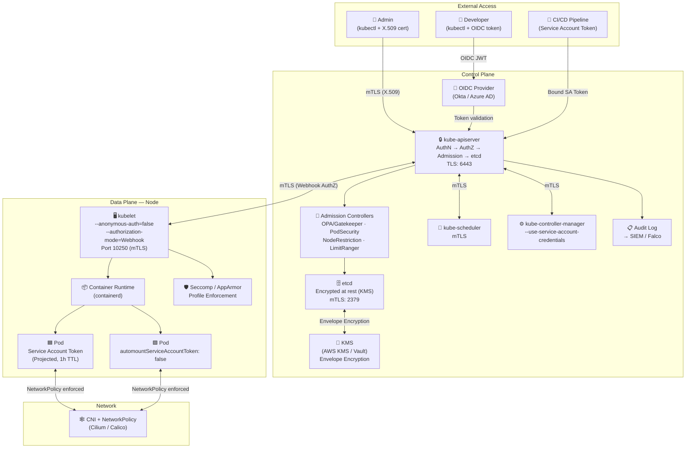

# Kubernetes Security Foundations
> **Target Audience:** Senior Engineers (8+ years) preparing for DevSecOps / Platform Security interviews  
> **Companion files:** `Secure-Cluster-Design.md`, `15-Kubernetes-Design-Patterns.md`

---

## Table of Contents
1. [K8s Architecture Security Components](#1-k8s-architecture-security-components)
2. [Authentication vs Authorization](#2-authentication-vs-authorization)
3. [RBAC Deep Dive](#3-rbac-deep-dive)
4. [Service Accounts](#4-service-accounts)
5. [etcd Encryption at Rest](#5-etcd-encryption-at-rest)
6. [TLS Everywhere](#6-tls-everywhere)
7. [Audit Logging](#7-audit-logging)
8. [Security Architecture Diagram](#8-security-architecture-diagram)
9. [YAML Examples](#9-yaml-examples)
10. [Interview Q&A — 15 Senior-Level Questions](#10-interview-qa--15-senior-level-questions)
11. [Tradeoffs and Failure Modes](#11-tradeoffs-and-failure-modes)
12. [References](#12-references)

---

## 1. K8s Architecture Security Components

Kubernetes security is not a single feature — it is a layered system of controls spanning the control plane, data plane, network, and storage layers. Understanding each component's threat surface is essential for senior-level interviews.

### 1.1 API Server (`kube-apiserver`)

The API server is the **single entry point** for all cluster operations. Every `kubectl` command, controller reconciliation loop, and admission webhook ultimately passes through it.

| Concern | Detail |
|---|---|
| **Authentication** | Validates *who* is making the request (certs, tokens, OIDC) |
| **Authorization** | Validates *what* they can do (RBAC, ABAC, Node, Webhook) |
| **Admission Control** | Mutating and Validating webhooks; built-in plugins (PodSecurity, LimitRanger) |
| **TLS termination** | All communication is encrypted in transit |
| **Audit trail** | Every request can be logged to an audit backend |

**Key hardening flags:**
```
--anonymous-auth=false
--authorization-mode=Node,RBAC
--enable-admission-plugins=NodeRestriction,PodSecurity,...
--audit-log-path=/var/log/kubernetes/audit.log
--encryption-provider-config=/etc/kubernetes/enc/config.yaml
--tls-cert-file / --tls-private-key-file
--oidc-issuer-url / --oidc-client-id   (if using OIDC)
```

### 1.2 etcd

etcd stores the **entire cluster state** including Secrets (base64-encoded by default, or encrypted if configured). Compromise of etcd equals full cluster compromise.

| Concern | Detail |
|---|---|
| **Access control** | mTLS between API server and etcd; no direct access for workloads |
| **Encryption at rest** | EncryptionConfiguration API (`aescbc`, `aesgcm`, KMS) |
| **Network isolation** | etcd should be on a separate network segment, port 2379/2380 firewalled |
| **Backup encryption** | Backup snapshots must also be encrypted |

### 1.3 kubelet

The kubelet is the node agent that manages pod lifecycle. It exposes an HTTP API (port 10250) that is a high-value attack target.

| Concern | Detail |
|---|---|
| **Anonymous auth** | Must be disabled (`--anonymous-auth=false`) |
| **Authorization** | Should use `Webhook` mode (defers to API server) |
| **Read-only port** | Port 10255 should be disabled (`--read-only-port=0`) |
| **Certificate rotation** | Enable `--rotate-certificates --rotate-server-certificates` |
| **Seccomp / AppArmor** | kubelet enforces pod-level security profiles |
| **Node restriction** | NodeRestriction admission plugin limits what the kubelet can modify |

### 1.4 Scheduler (`kube-scheduler`)

The scheduler selects which node a pod runs on. Security concerns are lower than API server/etcd, but hardening still applies.

- Should communicate with API server via mTLS
- Should not run with more RBAC permissions than needed
- Scheduler extenders (webhooks) must be TLS-secured

### 1.5 Controller Manager (`kube-controller-manager`)

Runs control loops (ReplicaSet, Deployment, Node lifecycle, etc.).

- `--use-service-account-credentials=true` — each controller gets its own service account token (least privilege)
- `--service-account-private-key-file` — used to sign tokens
- `--root-ca-file` — trusted CA bundle for token verification

### 1.6 Cloud Controller Manager

In managed K8s (EKS, GKE, AKS), the cloud controller manager integrates with cloud IAM. Workload Identity / IRSA patterns (see `15-Kubernetes-Design-Patterns.md`) apply here.

---

## 2. Authentication vs Authorization

### 2.1 Authentication (AuthN) — *Who are you?*

Kubernetes supports **multiple authentication strategies simultaneously**. The first strategy to succeed wins.

| Strategy | Use Case | Notes |
|---|---|---|
| **X.509 Client Certificates** | Admin access, control plane | Issued by cluster CA; hard to revoke without CA rotation |
| **Static Token File** | Legacy / testing only | **Never use in production** |
| **Bootstrap Tokens** | Node join process | Short-lived; consumed on use |
| **Service Account Tokens** | In-cluster workloads | Auto-mounted; bound tokens preferred (projected volumes) |
| **OIDC (OpenID Connect)** | Human SSO (Okta, Azure AD, Google) | Gold standard for human auth |
| **Webhook Token Auth** | Custom auth systems | External HTTP webhook validates tokens |
| **Authenticating Proxy** | Reverse proxy fronting API server | Passes headers X-Remote-User, X-Remote-Group |

**OIDC Flow:**

```
User → IdP (Okta/Azure AD) → ID Token (JWT) → kubectl --token=<id_token>
→ kube-apiserver: validates JWT signature, issuer, audience, expiry
→ extracts username (sub/email) and groups (groups claim)
```

Important OIDC flags:
```
--oidc-issuer-url=https://accounts.google.com
--oidc-client-id=kubernetes
--oidc-username-claim=email
--oidc-groups-claim=groups
--oidc-ca-file=/etc/ssl/oidc-ca.crt
```

### 2.2 Authorization (AuthZ) — *What can you do?*

After authentication, every request is checked by one or more authorization modules:

| Mode | Description |
|---|---|
| **RBAC** | Role-Based; most common; resources + verbs |
| **ABAC** | Attribute-Based; static file; largely deprecated |
| **Node** | Kubelet-specific; allows kubelets to read their own pods/secrets |
| **Webhook** | External service makes the authorization decision |
| **AlwaysAllow / AlwaysDeny** | Testing only; never production |

The recommended production setting is:
```
--authorization-mode=Node,RBAC
```
`Node` must come before `RBAC` so kubelets use the Node authorizer, not broad RBAC roles.

---

## 3. RBAC Deep Dive

### 3.1 Core Concepts

```
Subject ──binds to──► Role/ClusterRole ──grants──► Resources + Verbs
```

| Object | Scope | Purpose |
|---|---|---|
| `Role` | Namespaced | Permissions within one namespace |
| `ClusterRole` | Cluster-wide | Cross-namespace or cluster-scoped resources |
| `RoleBinding` | Namespaced | Binds Role or ClusterRole to subject in one namespace |
| `ClusterRoleBinding` | Cluster-wide | Binds ClusterRole to subject cluster-wide |

**Subjects:** `User`, `Group`, `ServiceAccount`

### 3.2 Verbs Reference

| Verb | HTTP Method | Description |
|---|---|---|
| `get` | GET | Read a single resource |
| `list` | GET | Read a collection |
| `watch` | GET+watch | Stream changes |
| `create` | POST | Create a resource |
| `update` | PUT | Full replace |
| `patch` | PATCH | Partial update |
| `delete` | DELETE | Delete one |
| `deletecollection` | DELETE | Delete many |
| `escalate` | — | Modify a Role beyond own permissions |
| `bind` | — | Create RoleBindings |
| `impersonate` | — | Act as another user |

> **Senior Insight:** `escalate`, `bind`, and `impersonate` are **privilege escalation verbs**. Any principal with these verbs on RBAC objects can effectively gain cluster-admin. Audit these rigorously.

### 3.3 Principle of Least Privilege in Practice

**Anti-patterns to call out in interviews:**
1. Wildcard verbs `["*"]` on any resource
2. Wildcard resources `["*"]` — especially combined with all verbs
3. `ClusterRoleBinding` where a namespaced `RoleBinding` would suffice
4. Binding to the `cluster-admin` ClusterRole for application service accounts
5. `list` + `watch` on `secrets` cluster-wide (secret enumeration)

### 3.4 Aggregated ClusterRoles

ClusterRoles can be composed using `aggregationRule`:

```yaml
aggregationRule:
  clusterRoleSelectors:
    - matchLabels:
        rbac.example.com/aggregate-to-monitoring: "true"
```

This pattern is used by `view`, `edit`, `admin` built-in roles — custom controllers can extend them without modifying the originals.

---

## 4. Service Accounts

### 4.1 Default Behavior and Risks

Every pod gets a service account token auto-mounted at:
```
/var/run/secrets/kubernetes.io/serviceaccount/token
```
By default this is a **long-lived, non-expiring** token (pre-1.24). Since Kubernetes 1.24, SA tokens are no longer created as Secrets automatically — instead, they use **bound service account tokens** (projected volumes, 1-hour expiry, audience-bound).

### 4.2 Disabling Auto-mount

```yaml
# At the ServiceAccount level (preferred):
apiVersion: v1
kind: ServiceAccount
metadata:
  name: my-app
  namespace: prod
automountServiceAccountToken: false

# At the Pod level (overrides SA setting):
spec:
  automountServiceAccountToken: false
```

Most application pods should not talk to the Kubernetes API. Disable auto-mount by default.

### 4.3 Bound Service Account Tokens (Projected Volumes)

```yaml
volumes:
  - name: token
    projected:
      sources:
        - serviceAccountToken:
            audience: api
            expirationSeconds: 3600
            path: token
```

This token:
- Expires after 1 hour
- Is audience-restricted
- Is bound to the pod's lifecycle (revoked when pod is deleted)
- Is not stored as a Secret

### 4.4 IRSA / Workload Identity

In cloud environments, service accounts are federated to cloud IAM roles via OIDC — see Pattern 15 in `15-Kubernetes-Design-Patterns.md`.

---

## 5. etcd Encryption at Rest

### 5.1 Why it Matters

Without encryption at rest, Secrets are stored in etcd as base64-encoded plaintext. Anyone with etcd access (or a backup) can `base64 -d` every secret in the cluster.

### 5.2 EncryptionConfiguration

```yaml
# /etc/kubernetes/enc/config.yaml
apiVersion: apiserver.config.k8s.io/v1
kind: EncryptionConfiguration
resources:
  - resources:
      - secrets
      - configmaps          # optional — add if ConfigMaps contain sensitive data
    providers:
      - aescbc:             # AES-CBC with PKCS#7 padding — widely supported
          keys:
            - name: key1
              secret: <base64-encoded-32-byte-key>
      - aesgcm:             # AES-GCM — faster, authenticated encryption
          keys:
            - name: key1
              secret: <base64-encoded-32-byte-key>
      - kms:                # Envelope encryption via KMS (AWS KMS, GCP KMS, HashiCorp Vault)
          name: myKmsPlugin
          endpoint: unix:///tmp/socketfile.sock
          cachesize: 1000
          timeout: 3s
      - identity: {}        # Fallback: no encryption (used during rotation)
```

**Provider order matters:** First provider is used for **writes**. All providers are tried for **reads** (decryption). During key rotation, add the new key first, restart, then remove the old key.

### 5.3 KMS Envelope Encryption (Recommended for Production)

```
Secret → API Server → KMS Plugin → Cloud KMS (AWS KMS / GCP KMS / Vault)
                                  ↓
                         Encrypted DEK stored in etcd
```

The data encryption key (DEK) is unique per secret. The KMS never stores the DEK — it only wraps/unwraps it. This allows:
- Key rotation without re-encrypting all data
- Hardware security module (HSM) backing
- Audit trail of every key usage

### 5.4 Verifying Encryption

```bash
# Write a test secret
kubectl create secret generic test-enc --from-literal=key=value -n default

# Check raw etcd value (must be done on etcd node or with etcdctl)
ETCDCTL_API=3 etcdctl get /registry/secrets/default/test-enc \
  --endpoints=https://127.0.0.1:2379 \
  --cacert=/etc/kubernetes/pki/etcd/ca.crt \
  --cert=/etc/kubernetes/pki/etcd/server.crt \
  --key=/etc/kubernetes/pki/etcd/server.key \
  | hexdump -C | head -20

# The output should start with "k8s:enc:aescbc:v1:key1:..." not plaintext
```

---

## 6. TLS Everywhere

### 6.1 Certificate Architecture

Kubernetes uses a PKI with multiple CAs:

```
Cluster Root CA (kubernetes-ca)
├── kube-apiserver serving cert
├── kube-apiserver client cert (to kubelet)
├── kubelet serving cert
├── kubelet client cert (to API server)
├── kube-scheduler client cert
├── kube-controller-manager client cert
├── admin kubeconfig cert
└── etcd CA (often separate)
    ├── etcd server cert
    ├── etcd peer cert
    └── etcd client cert (used by API server → etcd)
```

In production, use **separate CAs** for etcd and the cluster. This limits blast radius if a CA is compromised.

### 6.2 Certificate Rotation

```bash
# Check certificate expiry (kubeadm clusters)
kubeadm certs check-expiration

# Renew all certificates
kubeadm certs renew all

# Verify kubelet certificate rotation is enabled
# /var/lib/kubelet/config.yaml
rotateCertificates: true
serverTLSBootstrap: true
```

**Interview point:** Certificate expiry is a common outage cause. Automate rotation with `cert-manager` or cloud-managed PKI. Monitor expiry with Prometheus `x509_cert_expiry` metrics.

### 6.3 Mutual TLS (mTLS) Between Components

All core Kubernetes component communication uses mTLS — both client and server present certificates:

| Connection | Client Cert | Server Cert |
|---|---|---|
| kubectl → API server | User cert (kubeconfig) | API server serving cert |
| API server → kubelet | API server client cert | Kubelet serving cert |
| API server → etcd | etcd client cert | etcd server cert |
| etcd peer | etcd peer cert | etcd peer cert |

---

## 7. Audit Logging

### 7.1 Audit Policy Levels

| Level | What is logged |
|---|---|
| `None` | Nothing |
| `Metadata` | Request metadata (user, verb, resource) — no request/response body |
| `Request` | Metadata + request body |
| `RequestResponse` | Metadata + request body + response body |

### 7.2 Example Audit Policy

```yaml
# /etc/kubernetes/audit/policy.yaml
apiVersion: audit.k8s.io/v1
kind: Policy
omitStages:
  - RequestReceived          # Reduce noise; only log after processing
rules:
  # Log exec/attach/portforward at RequestResponse level
  - level: RequestResponse
    verbs: ["create"]
    resources:
      - group: ""
        resources: ["pods/exec", "pods/attach", "pods/portforward"]

  # Log secret access at Metadata level (no body — avoid logging secret values)
  - level: Metadata
    resources:
      - group: ""
        resources: ["secrets", "configmaps"]

  # Log all write operations on workloads
  - level: Request
    verbs: ["create", "update", "patch", "delete", "deletecollection"]
    resources:
      - group: "apps"
        resources: ["deployments", "replicasets", "daemonsets", "statefulsets"]

  # Log auth/authz changes at RequestResponse level
  - level: RequestResponse
    resources:
      - group: "rbac.authorization.k8s.io"
        resources: ["clusterroles", "clusterrolebindings", "roles", "rolebindings"]

  # Ignore health check noise
  - level: None
    users: ["system:kube-proxy"]
    verbs: ["watch"]
    resources:
      - group: ""
        resources: ["endpoints", "services"]

  # Catch-all: metadata for everything else
  - level: Metadata
```

### 7.3 Audit Backends

```
# Log backend (file)
--audit-log-path=/var/log/kubernetes/audit.log
--audit-log-maxage=30         # days
--audit-log-maxbackup=10
--audit-log-maxsize=100       # MB

# Webhook backend (ship to SIEM in real time)
--audit-webhook-config-file=/etc/kubernetes/audit/webhook.yaml
--audit-webhook-batch-max-size=400
--audit-webhook-batch-throttle-qps=10
```

**SIEM Integration:** Audit logs should be shipped to Splunk, Elastic, or Falco for real-time alerting on:
- `exec` into pods
- Secret reads outside CI/CD service accounts
- RBAC mutations
- `clusterrolebinding` creation

---

## 8. Security Architecture Diagram



---

## 9. YAML Examples

### 9.1 Namespace-scoped Role and RoleBinding

```yaml
# Role: read-only access to pods and pod logs in "prod" namespace
apiVersion: rbac.authorization.k8s.io/v1
kind: Role
metadata:
  name: pod-reader
  namespace: prod
rules:
  - apiGroups: [""]
    resources: ["pods", "pods/log"]
    verbs: ["get", "list", "watch"]
---
# RoleBinding: bind to a specific user
apiVersion: rbac.authorization.k8s.io/v1
kind: RoleBinding
metadata:
  name: pod-reader-binding
  namespace: prod
subjects:
  - kind: User
    name: alice@company.com    # OIDC email claim
    apiGroup: rbac.authorization.k8s.io
  - kind: Group
    name: platform-team        # OIDC groups claim
    apiGroup: rbac.authorization.k8s.io
roleRef:
  kind: Role
  name: pod-reader
  apiGroup: rbac.authorization.k8s.io
```

### 9.2 ClusterRole for a Monitoring Service Account

```yaml
apiVersion: rbac.authorization.k8s.io/v1
kind: ClusterRole
metadata:
  name: prometheus-scraper
rules:
  - apiGroups: [""]
    resources: ["nodes", "nodes/proxy", "services", "endpoints", "pods"]
    verbs: ["get", "list", "watch"]
  - apiGroups: ["extensions", "networking.k8s.io"]
    resources: ["ingresses"]
    verbs: ["get", "list", "watch"]
  - nonResourceURLs: ["/metrics", "/healthz"]
    verbs: ["get"]
---
apiVersion: rbac.authorization.k8s.io/v1
kind: ClusterRoleBinding
metadata:
  name: prometheus-scraper
subjects:
  - kind: ServiceAccount
    name: prometheus
    namespace: monitoring
roleRef:
  kind: ClusterRole
  name: prometheus-scraper
  apiGroup: rbac.authorization.k8s.io
```

### 9.3 Least-Privilege Service Account for Application

```yaml
# Service Account with auto-mount disabled
apiVersion: v1
kind: ServiceAccount
metadata:
  name: payment-service
  namespace: prod
  annotations:
    # IRSA annotation for AWS (see Pattern 15)
    eks.amazonaws.com/role-arn: arn:aws:iam::123456789012:role/payment-service-role
automountServiceAccountToken: false
---
# Pod using projected token (1h expiry, audience-restricted)
apiVersion: v1
kind: Pod
metadata:
  name: payment-service
  namespace: prod
spec:
  serviceAccountName: payment-service
  automountServiceAccountToken: false
  volumes:
    - name: aws-token
      projected:
        sources:
          - serviceAccountToken:
              audience: sts.amazonaws.com
              expirationSeconds: 3600
              path: token
  containers:
    - name: payment
      image: payment-service:v1.2.3@sha256:<digest>
      volumeMounts:
        - name: aws-token
          mountPath: /var/run/secrets/eks.amazonaws.com/serviceaccount
          readOnly: true
      securityContext:
        runAsNonRoot: true
        runAsUser: 10001
        allowPrivilegeEscalation: false
        readOnlyRootFilesystem: true
        capabilities:
          drop: ["ALL"]
      resources:
        requests:
          memory: "128Mi"
          cpu: "100m"
        limits:
          memory: "256Mi"
          cpu: "500m"
```

### 9.4 Restricting Privilege Escalation with ClusterRole

```yaml
# Deny binding to cluster-admin (OPA/Gatekeeper approach — see Pattern 12)
# Alternatively, ensure no subject has "escalate" or "bind" verbs:
apiVersion: rbac.authorization.k8s.io/v1
kind: ClusterRole
metadata:
  name: rbac-manager
rules:
  # Can manage roles but NOT bindings (prevents escalation)
  - apiGroups: ["rbac.authorization.k8s.io"]
    resources: ["roles", "clusterroles"]
    verbs: ["get", "list", "watch", "create", "update", "patch"]
  # Can create bindings only within own namespace (via RoleBinding, not ClusterRoleBinding)
  - apiGroups: ["rbac.authorization.k8s.io"]
    resources: ["rolebindings"]
    verbs: ["get", "list", "watch", "create", "update", "patch"]
    # NOTE: no "bind" verb means they cannot bind roles they don't already have
```

---

## 10. Interview Q&A — 15 Senior-Level Questions

---

### Q1: Walk me through what happens when `kubectl get pods -n prod` is executed.

**Model Answer:**

The request flows through several layers:

1. **kubectl** reads `~/.kube/config`, selects the active context, and builds an HTTP GET request to `https://<api-server>:6443/api/v1/namespaces/prod/pods`.

2. **TLS Handshake:** kubectl presents its client certificate; the API server presents its serving certificate. Both are verified against the cluster CA.

3. **Authentication:** The API server identifies the request. If using a kubeconfig with an X.509 cert, the CN becomes the username and O becomes the group. If using OIDC, the JWT is validated (signature, issuer, audience, expiry).

4. **Authorization (RBAC):** The API server checks whether the identified user/group has `get` and/or `list` on `pods` in namespace `prod`. It queries all RoleBindings in `prod` and all ClusterRoleBindings.

5. **Admission Control:** For read operations, mutating webhooks don't run. Validating webhooks may run (e.g., audit logging webhooks). For this read, admission is largely a pass-through.

6. **etcd Query:** The API server queries etcd for `/registry/pods/prod/`. The results are decrypted (if encryption at rest is configured), deserialized, and filtered by the user's namespace access.

7. **Response:** The pod list is returned, serialized to JSON/YAML, and displayed by kubectl.

**Follow-up:** *What if the user is not authorized?*  
The API server returns HTTP 403 Forbidden with a `Status` object containing the reason. The audit log captures this as a forbidden access attempt.

**What the interviewer is looking for:** Understanding of the complete request path, ability to reason about each security checkpoint, awareness that reads also go through AuthN/AuthZ (not just writes).

---

### Q2: What is the difference between a Role and a ClusterRole, and when would you use a ClusterRoleBinding with a Role?

**Model Answer:**

A **Role** is namespace-scoped — it only grants permissions within one namespace. A **ClusterRole** is cluster-scoped — it can grant permissions on cluster-level resources (nodes, PVs, namespaces themselves) or can be reused across namespaces.

The interesting case is binding a **ClusterRole** with a **RoleBinding** (not a ClusterRoleBinding). This restricts the ClusterRole's permissions to a single namespace. This is the recommended pattern for common roles (e.g., `view`, `edit`) because:
- You define the role once as a ClusterRole
- You bind it per-namespace as needed
- The subject cannot access other namespaces

Example: bind the built-in `edit` ClusterRole to a developer in the `staging` namespace only:
```yaml
kind: RoleBinding
apiGroup: rbac.authorization.k8s.io
subjects: [...]
roleRef:
  kind: ClusterRole    # ClusterRole referenced in a RoleBinding
  name: edit
```

**What the interviewer is looking for:** Understanding of the ClusterRole + RoleBinding composition pattern, which is commonly misunderstood even by experienced engineers.

---

### Q3: How would you detect and remediate RBAC privilege escalation in a running cluster?

**Model Answer:**

**Detection:**
1. **`kubectl auth can-i --list --as=<service-account>`** — enumerate effective permissions
2. **`rakkess`** or **`kubectl-who-can`** — open-source tools for RBAC auditing
3. **`rbac-lookup`** — who has access to what resource across the cluster
4. Audit log alerts: watch for `bind`, `escalate`, `impersonate` verbs being used
5. Policy scanners: `Polaris`, `KubeAudit`, `Trivy` (cluster scanning mode)
6. Look for wildcard rules: `kubectl get clusterrolebindings -o json | jq '.items[] | select(.subjects != null) | ...'`

**Remediation:**
1. Remove wildcard verb rules; enumerate explicit verbs
2. Replace ClusterRoleBindings with RoleBindings where possible
3. Remove `cluster-admin` bindings for service accounts
4. Enable `--authorization-mode=Node,RBAC` (ensure ABAC is disabled)
5. Rotate compromised service account tokens
6. Re-audit with OPA/Gatekeeper policy to prevent future violations

**What the interviewer is looking for:** Practical tooling knowledge, proactive detection vs reactive remediation, understanding of the blast radius of over-privileged RBAC.

---

### Q4: Explain etcd encryption at rest. Why is `identity` provider a risk?

**Model Answer:**

etcd stores K8s Secrets as base64-encoded values by default — base64 is encoding, not encryption. The `EncryptionConfiguration` API allows secrets to be encrypted before being written to etcd.

The `identity` provider is a no-op — it stores data in plaintext. The risk is that during key rotation, `identity` is temporarily added as a fallback provider for reads. If misconfigured (e.g., `identity` listed first), all new writes go to plaintext. This is why the ordering in `EncryptionConfiguration` is critical: the **first** provider is used for writes.

For production, the recommended provider is **KMS** (envelope encryption):
- The API server generates a unique DEK per secret
- The DEK is sent to KMS for wrapping (the KMS never sees the secret)
- The wrapped DEK + encrypted secret is stored in etcd
- On read, the wrapped DEK is sent to KMS for unwrapping, then used to decrypt

This provides: key rotation without re-encryption, HSM backing, per-request audit trail.

**Follow-up:** *How do you rotate encryption keys?*  
Add the new key as the first provider in the config, restart the API server, then run `kubectl get secrets --all-namespaces -o json | kubectl replace -f -` to re-encrypt all secrets with the new key, then remove the old key.

**What the interviewer is looking for:** Understands that base64 ≠ encryption, knows provider ordering semantics, can describe envelope encryption model.

---

### Q5: What are bound service account tokens, and why are they preferred over legacy SA secrets?

**Model Answer:**

Legacy service account tokens (pre-1.24) were created as `Secret` objects with no expiry, stored permanently in etcd. They were mounted into pods and could be extracted by anyone with pod exec access.

**Bound service account tokens** (GA in 1.20, default in 1.24) are projected into pods with:
- **Expiry** (default 1 hour, configurable)
- **Audience restriction** (e.g., `sts.amazonaws.com` for IRSA)
- **Pod binding** (token is revoked when the pod is deleted)
- **Node binding** (optional, token bound to a specific node)

They are not stored in etcd as Secrets — they are generated on-demand by the Token Request API and mounted via projected volume. This significantly reduces the blast radius of a token leak.

**What the interviewer is looking for:** Awareness of the lifecycle improvement, understanding of OIDC federation (IRSA/Workload Identity), ability to articulate security benefits concisely.

---

### Q6: Describe the NodeRestriction admission plugin. What attack does it prevent?

**Model Answer:**

The NodeRestriction admission plugin limits what a kubelet can modify via the API server. Without it, a compromised kubelet (running as `system:node:<nodeName>`) could:
- Modify labels on other nodes (e.g., add `node-role.kubernetes.io/master` to a worker)
- Read secrets for pods not scheduled on its node
- Modify pods on other nodes

With NodeRestriction enabled, a kubelet can only:
- Modify its own Node object (excluding restricted labels like `node-restriction.kubernetes.io/*`)
- Modify Pod objects for pods scheduled on its own node

This prevents **node privilege escalation** — a compromised worker cannot affect the control plane or other workers. It also prevents label spoofing attacks where a malicious node pretends to be a control-plane node to receive privileged pods.

**What the interviewer is looking for:** Understanding of the Node authorizer + NodeRestriction plugin as a defense-in-depth pair, not just listing admission controllers.

---

### Q7: How do you implement least-privilege for a CI/CD pipeline interacting with Kubernetes?

**Model Answer:**

1. **Dedicated service account per pipeline** — not the `default` SA, not shared across pipelines
2. **Namespace-scoped permissions** — RoleBinding (not ClusterRoleBinding) to the target namespace only
3. **Minimal verbs** — typically `create`, `update`, `patch` on `deployments`, `services`, `configmaps`; never `*`
4. **No `cluster-admin`** — even for infra pipelines; use explicit permissions
5. **Bound tokens** — use `kubectl create token <sa>` (short-lived) or projected volumes; avoid legacy Secret tokens
6. **OIDC for pipelines** — GitHub Actions OIDC, GitLab JWT, etc. federated to K8s RBAC eliminates stored credentials entirely
7. **Audit** — all pipeline API calls should be visible in audit logs; alert on unexpected verbs
8. **Namespace per environment** — pipelines for `dev` cannot affect `prod` namespace

For GitHub Actions OIDC:
```yaml
# GitHub Actions → OIDC token → exchanged for K8s SA token via TokenReview API
# No stored secrets in GitHub
```

**What the interviewer is looking for:** Practical implementation, awareness of OIDC federation for CI/CD, understanding that even CI/CD tools should follow least privilege.

---

### Q8: What is the difference between PodSecurityPolicy (deprecated) and the current Pod Security Admission?

**Model Answer:**

**PodSecurityPolicy (PSP)** was a cluster-wide admission controller removed in Kubernetes 1.25. It allowed fine-grained policies (e.g., allow specific volumes, capabilities, user ranges) but had significant usability problems:
- PSPs had to be created AND bound via RBAC to the pod's service account — a common misconfiguration point
- The RBAC binding model was counterintuitive (the SA needed `use` verb on the PSP)
- No dry-run/warn mode — a misconfiguration could break all workloads

**Pod Security Admission (PSA)** (GA in 1.25) replaces PSP with three built-in profiles:
- **`privileged`** — unrestricted (for system components)
- **`baseline`** — prevents known privilege escalation (no host namespaces, limited capabilities)
- **`restricted`** — hardened profile (requires non-root, drops all capabilities, seccomp required)

PSA is enforced at the namespace level via labels:
```yaml
metadata:
  labels:
    pod-security.kubernetes.io/enforce: restricted
    pod-security.kubernetes.io/warn: restricted
    pod-security.kubernetes.io/audit: restricted
```

Three modes: `enforce` (reject), `warn` (warn but allow), `audit` (log to audit). This enables gradual migration.

**Limitation of PSA vs PSP:** PSA cannot do fine-grained policies (e.g., allow only a specific set of sysctls). For that, use OPA/Gatekeeper or Kyverno.

**What the interviewer is looking for:** Knows PSP is gone, understands PSA profiles and modes, aware of PSA limitations and when to supplement with policy engines.

---

### Q9: How does the Kubernetes audit log differ from application logs, and what events should always be alerted on?

**Model Answer:**

Kubernetes audit logs are **API server access logs** — they record every operation on the Kubernetes API regardless of which application made it. Application logs are generated by workloads running inside pods.

Audit logs have a structured schema (`audit.k8s.io/v1 Event`) with fields: `user`, `verb`, `resource`, `namespace`, `requestURI`, `responseStatus`, `sourceIPs`.

**Events to always alert on:**
| Event | Why |
|---|---|
| `pods/exec` create | Interactive shell into running container |
| `secrets` read/list outside approved SAs | Credential exfiltration |
| `clusterrolebindings` create/update | Privilege escalation |
| `serviceaccounts/token` create | Token generation for impersonation |
| `nodes` update with control-plane labels | NodeRestriction bypass attempt |
| `namespaces` delete | Blast radius event |
| Any request from `system:anonymous` | Unauthenticated access |
| `impersonation` header usage | Privilege abuse |

**What the interviewer is looking for:** Understands audit logs as security telemetry, not just observability; can enumerate specific high-value events.

---

### Q10: What is the `system:masters` group and why is it dangerous?

**Model Answer:**

`system:masters` is a **hardcoded group** in the Kubernetes API server source code. Any user or service account in this group is granted cluster-admin privileges, bypassing ALL authorization checks including RBAC.

This is distinct from the `cluster-admin` ClusterRole (which is checked via RBAC) — `system:masters` membership grants access at the AuthZ level before RBAC is consulted.

**Why it's dangerous:**
1. Cannot be restricted or audited via RBAC — no Role can limit a `system:masters` member
2. Cannot be removed from a certificate (only CA rotation removes it)
3. Often appears in kubeconfig certs generated by `kubeadm init` for the admin user
4. If a certificate with `O=system:masters` is leaked, full cluster compromise

**Mitigation:**
- Do not issue X.509 certificates with `O=system:masters` to human users
- Use OIDC + a specific `cluster-admin` ClusterRoleBinding for break-glass access
- Store `system:masters` certs in a vault, audit access
- Implement cert-based break-glass: short-lived `system:masters` cert generated only under break-glass procedure

**What the interviewer is looking for:** Knows the difference between RBAC cluster-admin and the hardcoded group; understands why it cannot be restricted post-issuance.

---

### Q11: How do you secure communication between pods without a service mesh?

**Model Answer:**

Without a service mesh, application-layer encryption between pods must be implemented at the application level:

1. **NetworkPolicy** — L3/L4 enforcement (IP + port). Does not encrypt traffic but restricts which pods can communicate. Essential baseline:
```yaml
# Default deny all ingress in a namespace
spec:
  podSelector: {}
  policyTypes: [Ingress, Egress]
```

2. **Application-level TLS** — each service presents a certificate. Use `cert-manager` to issue and rotate certificates automatically from an internal CA.

3. **Mutual TLS in application code** — both client and server validate certificates. Harder to operationalize without a mesh.

4. **CNI encryption** — Some CNI plugins (Cilium with WireGuard, Calico with WireGuard) encrypt traffic at the node level transparently. This protects all pod traffic without application changes.

5. **Secret injection** — Use an external secrets operator or Vault agent injector to deliver TLS certs to pods.

The limitation of the no-mesh approach: no uniform policy enforcement, no automatic certificate rotation across all services, no traffic observability (mTLS verification must be per-service).

**What the interviewer is looking for:** Doesn't jump straight to "use Istio" — considers layered approaches, knows NetworkPolicy is not encryption, aware of CNI-level encryption.

---

### Q12: Explain the Kubernetes threat model for supply chain attacks.

**Model Answer:**

Kubernetes-specific supply chain attack vectors:

1. **Image compromise** — malicious image layers, vulnerable base images, hijacked registries
   - Mitigations: Image signing (Cosign/Notary), admission policies (ImagePolicyWebhook, Kyverno), image scanning (Trivy, Grype), digest pinning

2. **Helm chart / manifest injection** — malicious values, subverted chart repositories
   - Mitigations: Chart signing, private chart repositories, OPA policies on Helm releases

3. **CI/CD pipeline compromise** — build environment contamination, credential theft
   - Mitigations: Ephemeral build environments, OIDC-based credentials (no stored tokens), SLSA provenance attestations

4. **Init container abuse** — init containers can modify the shared filesystem before the main container starts
   - Mitigations: OPA policies restricting init container images, same image signing requirements

5. **Operator/controller compromise** — operators have broad cluster permissions; a compromised operator binary is a full cluster compromise
   - Mitigations: Operator RBAC review, admission policies on CRDs, pin operator image digests

6. **Registry hijack** — DNS hijack of private registry, BGP hijack of public registries
   - Mitigations: Digest pinning (not tags), private registry mirroring, network policies restricting egress to approved registries only

**What the interviewer is looking for:** Breadth of supply chain attack surface, practical mitigations per vector, SLSA framework awareness.

---

### Q13: What is the difference between seccomp, AppArmor, and SELinux in the context of Kubernetes?

**Model Answer:**

All three are Linux kernel security mechanisms that can be applied to containers:

| Mechanism | What it restricts | Kubernetes Integration |
|---|---|---|
| **seccomp** | System calls available to the container | `securityContext.seccompProfile` |
| **AppArmor** | File system paths, capabilities, network access (profile-based) | `metadata.annotations` (soon `securityContext`) |
| **SELinux** | Access control labels on all kernel objects (files, processes, sockets) | `securityContext.seLinuxOptions` |

**seccomp** is the most universally available and easiest to use. Kubernetes 1.22+ includes a `RuntimeDefault` profile that blocks ~300 dangerous syscalls. `Unconfined` (old default) provides no syscall filtering.

```yaml
securityContext:
  seccompProfile:
    type: RuntimeDefault    # or Localhost with a custom profile
```

**AppArmor** is node-dependent (profile must be loaded on each node). Useful for filesystem path restrictions. Example annotation:
```yaml
metadata:
  annotations:
    container.apparmor.security.beta.kubernetes.io/nginx: runtime/default
```

**SELinux** is label-based, most powerful but most complex. Used heavily in Red Hat/OpenShift environments. Each process and file has a label; policy defines allowed transitions.

**What the interviewer is looking for:** Knows these are complementary (not alternatives), can differentiate syscall vs path vs label-based controls, knows Kubernetes integration points.

---

### Q14: How would you design an RBAC strategy for a 50-team organization using a single Kubernetes cluster?

**Model Answer:**

**Namespace-per-team model with centralized cluster management:**

1. **Namespace strategy:** Each team gets one or more namespaces (e.g., `team-payments-dev`, `team-payments-prod`). Use resource quotas and LimitRanges per namespace.

2. **Standard role set:** Define ClusterRoles for common personas, bound via RoleBindings per namespace:
   - `team-developer`: `get`, `list`, `watch`, `create`, `update`, `patch` on deployments, services, configmaps; `get` on secrets
   - `team-viewer`: `get`, `list`, `watch` only
   - `team-debugger`: above + `pods/exec`, `pods/log`

3. **OIDC + group claims:** Map team membership in IdP (Okta groups) to RBAC groups. No per-user bindings — only group bindings. When a team member joins or leaves, IdP group membership propagates automatically.

4. **No direct cluster-admin for developers:** Platform team manages cluster-admin access via break-glass procedure (time-bound, audited).

5. **GitOps for RBAC:** Store all RoleBindings in Git (ArgoCD/Flux). All RBAC changes go through PR review. Audit trail in Git history.

6. **Policy guardrails:** OPA/Gatekeeper or Kyverno to:
   - Prevent teams from creating ClusterRoleBindings
   - Require namespace label selectors in all RoleBindings
   - Prevent `cluster-admin` binding

7. **Audit alerts:** SIEM alert on any ClusterRoleBinding creation, any direct user (non-group) binding.

**What the interviewer is looking for:** Scalable design (group-based not user-based), GitOps for RBAC (auditability), policy enforcement, platform team separation from team access.

---

### Q15: A developer reports they cannot `kubectl exec` into their pod. How do you troubleshoot?

**Model Answer:**

Systematic troubleshooting across authentication, authorization, and network layers:

**Step 1: Identify the actual error**
```bash
kubectl exec -it <pod> -n <namespace> -- /bin/sh 2>&1
# "Error from server (Forbidden)" → AuthZ issue
# "Error from server (ServiceUnavailable)" → kubelet connectivity
# "OCI runtime exec failed" → container runtime issue
# connection timeout → network issue
```

**Step 2: Check RBAC**
```bash
kubectl auth can-i create pods/exec -n <namespace> --as=<username>
# Also check for the verb:
kubectl auth can-i create pods/exec -n <namespace> --as=<username> --subresource=exec
```

**Step 3: Audit log**
```bash
# Search for the user's forbidden events
grep '"verb":"create".*"resource":"pods".*"subresource":"exec".*"code":403' /var/log/kubernetes/audit.log
```

**Step 4: Check if exec is blocked by admission**
- OPA/Gatekeeper or Kyverno policy may block exec (common in production namespaces)
- PodSecurityAdmission may not directly block exec, but NetworkPolicy may

**Step 5: Kubelet connectivity**
- API server must be able to reach kubelet on port 10250
- Check `--enable-debugging-handlers=true` on kubelet (required for exec)
- Check NetworkPolicy for egress from API server to nodes

**Step 6: Check if exec is allowed for the container**
- Some admission policies block exec on containers running as root
- Check if the container's shell exists: `kubectl exec ... -- which sh`

**What the interviewer is looking for:** Systematic layered approach, use of `kubectl auth can-i --as`, awareness of both RBAC and admission layers, network troubleshooting.

---

## 11. Tradeoffs and Failure Modes

### Tradeoffs

| Decision | Benefit | Risk |
|---|---|---|
| **OIDC for all humans** | No long-lived certs; central revocation | OIDC provider outage blocks kubectl access |
| **Encrypt all of etcd** | Secrets protected at rest | Performance overhead; KMS outage can break API server |
| **Restrict all `exec`** | Reduces attack surface | Slows incident response; need alternative debugging strategy |
| **Audit level RequestResponse** | Full forensics | High log volume; secrets may appear in response bodies |
| **automountServiceAccountToken: false** | Reduces credential exposure | Breaks pods that need API access (operators, monitoring agents) |
| **Node authorization mode** | Limits kubelet blast radius | Must combine with NodeRestriction plugin to be effective |

### Common Failure Modes

1. **Certificate expiry causing full cluster outage** — Monitor with `kubeadm certs check-expiration`, Prometheus cert expiry alerts, automate rotation
2. **KMS unavailability blocking API server startup** — API server cannot decrypt etcd values; implement KMS HA and local caching
3. **OIDC provider outage** — All humans locked out; maintain break-glass X.509 kubeconfig in a vault
4. **Over-restricting NetworkPolicy** — Blocks DNS (UDP 53 to kube-dns), health checks, metrics scraping; test in warn mode first
5. **Audit log disk exhaustion** — Fills node disk, crashes API server; set `--audit-log-maxsize` and ship to external SIEM
6. **PSA `restricted` enforced prematurely** — Breaks existing workloads; use `warn` mode first, then `enforce`

---

## 12. References

| Resource | URL |
|---|---|
| Kubernetes Auth Documentation | https://kubernetes.io/docs/reference/access-authn-authz/ |
| Kubernetes RBAC Documentation | https://kubernetes.io/docs/reference/access-authn-authz/rbac/ |
| CIS Kubernetes Benchmark | https://www.cisecurity.org/benchmark/kubernetes |
| NSA/CISA Kubernetes Hardening Guide | https://media.defense.gov/2022/Aug/29/2003066362/-1/-1/0/CTR_KUBERNETES_HARDENING_GUIDANCE_1.2_20220829.PDF |
| Kubernetes Audit Logging | https://kubernetes.io/docs/tasks/debug/debug-cluster/audit/ |
| Encryption at Rest | https://kubernetes.io/docs/tasks/administer-cluster/encrypt-data/ |
| Pod Security Admission | https://kubernetes.io/docs/concepts/security/pod-security-admission/ |
| Service Account Token | https://kubernetes.io/docs/reference/access-authn-authz/service-accounts-admin/ |
| RBAC Good Practices | https://kubernetes.io/docs/concepts/security/rbac-good-practices/ |
| 4C's of Cloud Native Security | https://kubernetes.io/docs/concepts/security/overview/ |
| kube-bench (CIS Benchmark tool) | https://github.com/aquasecurity/kube-bench |
| rbac-lookup | https://github.com/FairwindsOps/rbac-lookup |
| kubectl-who-can | https://github.com/aquasecurity/kubectl-who-can |
| rakkess | https://github.com/corneliusweig/rakkess |
